# Life POST /quotes Detailed End-to-End Flow

This document explains the full backend flow for:

- `POST /api/minterprise/v2/products/life/quotes`

This is the detailed technical flow for the Life quote generation API in `minterprise`.

It covers:

- exact entry point and function chain
- what data is passed into each major function
- what each function changes
- every external API call in the main quote flow
- request normalization
- product filtering and nearest-match logic
- rider and offer pre-enrichment
- insurer-wise payload construction
- insurer response handling and normalization
- DB save and merge logic
- async rider-price flow triggered after quote save
- final API response reconstruction from DB

This document is intentionally detailed. Examples are trimmed for readability, but the flow and field names are aligned to the current code.

Related docs:

- `/Users/biswajitrout/companyProjects/minterprise/transactional-flows/docs/life-quote-post-api-spec.md`
- `/Users/biswajitrout/companyProjects/minterprise/transactional-flows/docs/life-quote-flow.md`
- `/Users/biswajitrout/companyProjects/minterprise/transactional-flows/docs/life-quote-fe-payload-spec.md`
- `/Users/biswajitrout/companyProjects/minterprise/transactional-flows/docs/life-quote-db-storage-spec.md`

## 1. Main files involved

Controller:

- `/Users/biswajitrout/companyProjects/minterprise/transactional-flows/src/main/java/com/sachetProduct/controllers/SachetController.java`

Main service:

- `/Users/biswajitrout/companyProjects/minterprise/transactional-flows/src/main/java/com/sachetProduct/service/impl/IQuotationServiceImpl.java`

Life aggregator:

- `/Users/biswajitrout/companyProjects/minterprise/transactional-flows/src/main/java/com/sachetProduct/service/aggregator/SachetLifeAggregator.java`

Validation:

- `/Users/biswajitrout/companyProjects/minterprise/transactional-flows/src/main/java/com/sachetProduct/service/aggregator/life/LifeRequestValidationService.java`
- `/Users/biswajitrout/companyProjects/minterprise/transactional-flows/src/main/java/com/sachetProduct/service/aggregator/life/LifeProductCatalogueService.java`

Request builder / insurer payload build:

- `/Users/biswajitrout/companyProjects/minterprise/transactional-flows/src/main/java/com/sachetProduct/service/aggregator/life/LifeQuoteIntegrationRequestBuilder.java`

IH dispatch and response preparation:

- `/Users/biswajitrout/companyProjects/minterprise/transactional-flows/src/main/java/com/sachetProduct/service/aggregator/life/LifePremiumDispatchService.java`
- `/Users/biswajitrout/companyProjects/minterprise/transactional-flows/src/main/java/com/sachetProduct/service/aggregator/life/normalizer/`

Master-data enrichment:

- `/Users/biswajitrout/companyProjects/minterprise/transactional-flows/src/main/java/com/sachetProduct/service/aggregator/life/LifeQuoteMasterDataEnrichmentService.java`

Save / merge:

- `/Users/biswajitrout/companyProjects/minterprise/transactional-flows/src/main/java/com/sachetProduct/util/PremiumServiceUtil.java`
- `/Users/biswajitrout/companyProjects/minterprise/transactional-flows/src/main/java/com/sachetProduct/service/impl/DefaultAggregatorServiceImpl.java`

Async rider prices:

- `/Users/biswajitrout/companyProjects/minterprise/transactional-flows/src/main/java/com/sachetProduct/service/aggregator/life/LifeRiderPricesAsyncService.java`

DAO / final Mongo write:

- `/Users/biswajitrout/companyProjects/minterprise/transactional-flows/src/main/java/com/sachetProduct/dao/QuotationRequestRepository.java`
- `/Users/biswajitrout/companyProjects/minterprise/transactional-flows/src/main/java/com/sachetProduct/dao/QuotationResultRepository.java`
- `/Users/biswajitrout/companyProjects/minterprise/library/src/main/java/com/library/dao/mongodb/AbstractReactiveMongoDAO.java`

## 2. Collections used in this flow

Primary collections:

- `sachetPremiumRequest`
- `sachetPremiumRequestHistory`
- `sachetPremiumResponse`
- `lifeRiderPrices`

Reference / config / master collections read during the flow:

- `brokerConfig`
- `lifeInsurerProviderMeta`
- `CompanyDetails`
- `lifeRiderMaster`
- `lifeOfferMaster`
- `lifeUlipFundAllocationMaster`
- `LifeResponseAttributionRules`

## 3. Example incoming API request

Example request body sent to:

- `POST /api/minterprise/v2/products/life/quotes`

```json
{
  "data": {
    "premiumRequest": {
      "pospUserName": "66bb2378ae016500016e5a06",
      "personalDetails": {
        "customerName": "ABID AHMAD SHAH",
        "userMobile": "7400400747",
        "userEmail": "SHAHABID37@GMAIL.COM"
      },
      "proposerDetails": {},
      "riskInsured": {
        "insuredMembers": [
          {
            "insuredFullName": "ABID AHMAD SHAH",
            "dateOfBirth": "1972-05-03T00:00:00+05:30",
            "entryAge": 53,
            "gender": "M"
          }
        ]
      },
      "planDetails": {
        "policyType": "TERM",
        "planType": "Term",
        "categories": [
          "term"
        ],
        "coverAmount": 10000000,
        "paymentFrequency": 12,
        "profileType": "term",
        "businessModel": "B2B",
        "investmentRisk": "high",
        "investmentTermCode": "medium",
        "benifitCalculationRate": 8,
        "tmOccupation": "salaried",
        "tmQualification": "Graduate_Post_Graduate",
        "isSmoking": false,
        "maritalStatus": "SINGLE",
        "incomeBracketCode": "7 Lakhs",
        "minIncome": 500000,
        "maxIncome": 699999,
        "tmPincode": 192125
      },
      "vertical": "LIFE"
    }
  }
}
```

Headers usually used with this route:

- `x-tenant`
- `x-broker`
- `x-partner-id`
- optional `x-provider`

## 4. Full high-level sequence

At a high level the flow is:

1. Controller converts `request.data` into `QuotationRequest`.
2. Quote service normalizes and saves the request.
3. Life validator resolves valid insurer/product rows.
4. Aggregator expands one request into multiple scoped requests.
5. Each scoped request is enriched with rider/offer metadata.
6. Each scoped request is converted into an insurer-facing IH payload.
7. IH is called for each scoped request.
8. Each insurer response is normalized and enriched.
9. Each result is saved to DB, and Life rows are merged if needed.
10. Async rider-price generation is triggered for successful rows.
11. After all save operations finish, the final API response is rebuilt from DB and returned.

Important point:

- Life quote response is not returned incrementally as each insurer result arrives.
- Each result row is saved one by one.
- The final API response is rebuilt in one shot from DB after those save operations complete.

## 5. Step-by-step detailed flow

## 5.1 Controller entry

Function:

- `SachetController.addQuotation(...)`

What goes in:

- path variable `productCode`
- headers `x-tenant`, `x-broker`, `x-partner-id`, `x-provider`
- request body `PayloadWrapper`

What it does:

1. Converts `request.getData()` into `QuotationRequest`.
2. Sets:
   - `productCode`
   - `tenant`
   - `broker`
   - `partnerId`
   - `provider`
3. Calls `quotationService.generateQuote(premiumRequest)`.

Input shape inside controller:

```json
{
  "productCode": "life",
  "tenant": "axisbank",
  "broker": "axisbank",
  "partnerId": "647f458828effa0001044980",
  "provider": null,
  "premiumRequest": {
    "...": "payload from request.data"
  }
}
```

This layer does not do Life business logic. It only prepares the request object.

## 5.2 Main quote-service entry

Function:

- `IQuotationServiceImpl.generateQuote(...)`

Life branch taken:

- `if ("life".equalsIgnoreCase(request.getProductCode()))`

What goes in:

- `QuotationRequest` built by the controller

What it does:

1. Reads `request.premiumRequest`.
2. Extracts `premiumRequest.riskInsured`.
3. Sets `request.riskInsured`.
4. Calls `validatePremium(request)`.
5. After validation/save, routes to:
   - `gridPremiumAggregatorFactory.getPremiumAggregator("life").generateQuote(pr)`
6. For Life this lands in `SachetLifeAggregator.generateQuote(...)`.

Why this branch matters:

- Non-Life uses shared validation before aggregator dispatch.
- Life goes directly into the Life-specific validation and quote pipeline.

## 5.3 Request normalization before save

Functions:

- `IQuotationServiceImpl.validatePremium(...)`
- `IQuotationServiceImpl.normalizeLifeRequestForStorage(...)`
- `LifeRequestValidationService.deriveLifeRequestFieldsForStorage(...)`

### What goes in

The original `QuotationRequest`, where the actual Life inputs mainly sit inside:

- `premiumRequest.planDetails`
- `premiumRequest.personalDetails`
- `premiumRequest.proposerDetails`
- `premiumRequest.riskInsured`

### What `normalizeLifeRequestForStorage(...)` does

1. Converts `premiumRequest` to a map.
2. Calls `deriveLifeRequestFieldsForStorage(...)`.
3. That internally reuses the Life validation normalization logic to derive:
   - `entryAge`
   - `policyTerm`
   - `premiumPaymentTerm`
   - `maturityAge`
   - `jointLifeAge`
   - `investmentTermCode`
   - defaults for retirement / whole-life / term cases
4. Writes derived values back into `premiumRequest.planDetails`.
5. Copies `premiumRequest.riskInsured` to top-level `request.riskInsured`.
6. If `premiumRequest.vertical` exists, sets `request.productCode` from it.
7. Sets `request.leadName` from `premiumRequest.personalDetails.customerName`.
8. If `premiumRequest.pospUserName` is present, it is used as `request.partnerId`.

### Example: before and after normalization

Before:

```json
{
  "premiumRequest": {
    "planDetails": {
      "planType": "Term",
      "categories": ["term"],
      "coverAmount": 10000000,
      "paymentFrequency": 12
    },
    "riskInsured": {
      "insuredMembers": [
        {
          "dateOfBirth": "1972-05-03T00:00:00+05:30",
          "entryAge": 53,
          "gender": "M"
        }
      ]
    },
    "personalDetails": {
      "customerName": "ABID AHMAD SHAH"
    },
    "vertical": "LIFE",
    "pospUserName": "66bb2378ae016500016e5a06"
  }
}
```

After normalization:

```json
{
  "productCode": "life",
  "partnerId": "66bb2378ae016500016e5a06",
  "leadName": "ABID AHMAD SHAH",
  "riskInsured": {
    "insuredMembers": [
      {
        "dateOfBirth": "1972-05-03T00:00:00+05:30",
        "entryAge": 53,
        "gender": "M"
      }
    ]
  },
  "premiumRequest": {
    "planDetails": {
      "planType": "Term",
      "categories": ["term"],
      "coverAmount": 10000000,
      "paymentFrequency": 12,
      "policyTerm": 22,
      "premiumPaymentTerm": 22,
      "maturityAge": 75
    }
  }
}
```

The exact derived values depend on category, age, and request fields.

## 5.4 Initial quote vs requote handling

Function:

- `IQuotationServiceImpl.validatePremium(...)`

### Initial quote

If `referenceId` is blank:

1. A new `referenceId` is generated.
2. A new request-level `quoteId` is generated.
3. `createdAt` and `updatedAt` are set.
4. The request is treated as a fresh quote journey.

### Requote

If `referenceId` already exists:

1. `stashLifeRequoteInsurerSpecificInfo(request)` is called.
2. Existing request is loaded using `getRequestFromDB(...)`.
3. Existing `_id` and `createdAt` are preserved.
4. Stored `insurerSpecificInfo` is preserved back into the new request using:
   - `preserveStoredLifeInsurerSpecificInfo(...)`
5. Internal requote metadata is later stripped before request persistence using:
   - `stripInternalLifeRequoteMetadata(...)`

Why this exists:

- Life requote must preserve previous insurer-specific context and not behave like a brand-new quote unless the request truly is new.

## 5.5 Request persistence

Functions:

- `IQuotationServiceImpl.performValidation(...)`
- `IQuotationServiceImpl.saveAPIPremiumRequest(...)`
- `quotationRequestRepository.saveData(...)`
- `savePremiumRequestHistory(...)`

What goes in:

- normalized `QuotationRequest`

What happens:

1. For Life, request is cloned before persistence.
2. The persisted request row has `quoteId = null`.
3. Internal requote-only fields are removed.
4. Request row is saved to `sachetPremiumRequest`.
5. History row is saved to `sachetPremiumRequestHistory`.

Important Life-specific behavior:

- A request-level `quoteId` is generated in memory for processing, but request rows for Life are intentionally persisted with `quoteId = null`.

### Example stored request row

```json
{
  "_id": "6998b8c8df2d8a2f1b9f1001",
  "referenceId": "AHUTP1QQBR8",
  "quoteId": null,
  "productCode": "life",
  "tenant": "axisbank",
  "broker": "axisbank",
  "partnerId": "66bb2378ae016500016e5a06",
  "leadName": "ABID AHMAD SHAH",
  "riskInsured": {
    "insuredMembers": [
      {
        "insuredFullName": "ABID AHMAD SHAH",
        "dateOfBirth": "1972-05-03T00:00:00+05:30",
        "entryAge": 53,
        "gender": "M"
      }
    ]
  },
  "premiumRequest": {
    "...": "normalized FE payload"
  }
}
```

## 5.6 Life aggregator entry

Function:

- `SachetLifeAggregator.generateQuote(...)`

What goes in:

- persisted and validated `QuotationRequest`

What it does:

1. Builds optional provider filter from `request.provider`.
2. Calls `lifeRequestValidationService.resolveValidatedProviders(request, configuredProviders)`.
3. Applies requote-specific narrowing using `filterValidationResultForRequote(...)`.
4. Builds one scoped service request per valid product row using `buildLifeServiceRequests(...)`.
5. If no valid service requests remain:
   - for requote, fetches existing DB response and filters it
   - otherwise returns a validation-style failure
6. If service requests exist:
   - calls `fetchCustomPremiumResponse(serviceRequests, request)`

Important behavior:

- One inbound request becomes many insurer/product scoped requests.
- Quote execution happens only after Life validation rows are prepared.

## 5.7 Life validation: canonical request view

Functions:

- `LifeRequestValidationService.resolveValidatedProviders(...)`
- `resolveLifePremiumRequest(...)`
- `normalizeLifeRequestForValidation(...)`
- `applyLifeDefaultDerivations(...)`

### What `resolveLifePremiumRequest(...)` does

It currently takes the canonical Life plan input from:

- `premiumRequest.planDetails`

and starts validation from there.

### What `normalizeLifeRequestForValidation(...)` adds

It merges missing fields from:

- first insured member from `riskInsured.insuredMembers[0]`
- `proposerDetails`
- top-level `premiumRequest`
- `jointLifeDetails`

### What `applyLifeDefaultDerivations(...)` derives

- `entryAge` from DOB if needed
- proposer age fallback for non-self journey
- retirement defaults
- whole-life defaults
- term maturity defaults
- `policyTerm`
- `premiumPaymentTerm`
- `maturityAge`
- `investmentTermCode`
- `jointLifeAge`

### Example normalized validation map

```json
{
  "planType": "Term",
  "policyType": "TERM",
  "categories": ["term"],
  "coverAmount": 10000000,
  "paymentFrequency": 12,
  "entryAge": 53,
  "maturityAge": 75,
  "policyTerm": 22,
  "premiumPaymentTerm": 22,
  "currency": "INR",
  "isJointLife": false,
  "isNonSelfJourney": false,
  "tmOccupation": "salaried",
  "tmQualification": "Graduate_Post_Graduate",
  "tmPincode": 192125
}
```

## 5.8 Product catalogue lookup

Functions:

- `LifeRequestValidationService.fetchEnabledProductMasters(...)`
- `fetchEnabledProductsFromIntegrationHub(...)`
- `LifeProductCatalogueService.fetchProductDetails(...)`
- `fetchProductDetailsFromSource(...)`
- `extractProductDetails(...)`
- `normalizeProductDetailRows(...)`
- `flattenProductDetailPage(...)`
- `extractPdpValue(...)`

External API called:

- `POST /api/product-management/v1/products/details/filters`

Request body sent by `LifeProductCatalogueService`:

```json
{
  "broker": "axisbank",
  "businessCategory": "LIFE",
  "businessSubCategory": "LIFE",
  "productStatus": "LIVE",
  "inclusions": ["PDP", "INTEGRATION_INFO"]
}
```

What comes back:

- product catalogue rows with PDP data and integration info

What `normalizeProductDetailRows(...)` converts it into:

- one normalized row per insurer product variant

### Example normalized product row

```json
{
  "productCode": "P127",
  "internalProductCode": "maxlifeli-life-smarttermplanplus",
  "insurerCode": "MAXLIFELI",
  "insurerName": "Axis Max Life",
  "optionCode": "1",
  "optionName": "Regular cover",
  "productName": "Smart Term Plan Plus",
  "tmPlanId": "1460",
  "planType": "TERM",
  "policyType": "TERM",
  "categoryTags": ["term"],
  "paymentFrequencyModes": [1, 2, 4, 12],
  "payoutTypes": ["lumpsum", "lumpsum_plus_level_income"],
  "payoutFrequencies": ["yearly", "monthly"],
  "payoutBenefitTerms": [5, 10],
  "planFeatureList": [
    {
      "code": "jointLife",
      "active": true
    }
  ],
  "riders": [
    {
      "riderCode": "ADB"
    }
  ],
  "offers": [],
  "currency": "INR",
  "showRider": true,
  "showRiderPremium": true
}
```

## 5.9 Filtering before quote generation

Functions:

- `fetchEnabledProductMasters(...)`
- `applyLifePostFiltersWithDefaults(...)`
- `applyPayoutDefaults(...)`
- `filterByPayoutSettings(...)`
- `filterByPlanFeatures(...)`
- `extractRequestedPlanFeatureCodes(...)`
- `matchesPlanFeature(...)`

Base filters applied:

- plan type
- policy type
- categories
- payment frequency
- currency
- selected plans
- configured insurer/provider filter

Additional Life-specific filters:

- payout type
- payout term
- payout frequency
- joint life support
- return of premium support

### Example

If the request says:

```json
{
  "planType": "Term",
  "categories": ["term"],
  "paymentFrequency": 12,
  "payoutType": "LUMPSUM_PLUS_LEVEL_INCOME",
  "payoutFrequency": "YEARLY",
  "jointLifeDetails": {
    "status": true
  }
}
```

Then rows are kept only if:

- row supports term
- row supports yearly mode
- row supports requested payout type
- row supports requested payout frequency
- row has active `jointLife` feature

If any filter makes the row list empty, that insurer/product combination never reaches IH.

## 5.10 Nearest-match PT/PPT selection

Functions:

- `createLifeValidatorRows(...)`
- `applyNearestMatch(...)`
- `buildValidationRequest(...)`
- `fetchNearestMatchMap(...)`
- `parseNearestMatchMap(...)`
- `selectNearestMatch(...)`

External API called:

- `POST /api/product-management/v1/life-validator`

Request body shape:

```json
{
  "productCode": [
    "maxlifeli-life-smarttermplanplus",
    "icicipruli-life-iprotectsmartplus"
  ],
  "scope": {
    "entryAge": 53,
    "policyTerm": 22,
    "premiumPaymentTerm": 22,
    "paymentFrequency": 12,
    "sumAssured": 10000000,
    "planType": "Term",
    "categories": ["term"],
    "isNonSelfJourney": false,
    "isJointLife": false
  }
}
```

What it returns:

- nearest valid PT/PPT combinations per internal product and variant

What `applyNearestMatch(...)` does:

1. Matches the response back to each validator row.
2. Writes:
   - `policyTerm`
   - `premiumPaymentTerm`
   - `score`
3. Drops rows that did not get a nearest-match result.

### Example validator row after nearest match

```json
{
  "productCode": "P127",
  "internalProductCode": "maxlifeli-life-smarttermplanplus",
  "insurerCode": "MAXLIFELI",
  "optionCode": 1,
  "policyTerm": 22,
  "premiumPaymentTerm": 22,
  "score": 0
}
```

## 5.11 Validation output object

Functions:

- `groupRowsByProvider(...)`
- `filterProviders(...)`
- `createValidationMap(...)`

Final validation result returned by `resolveValidatedProviders(...)`:

```json
{
  "providers": [
    {
      "provider": "MAXLIFELI"
    },
    {
      "provider": "ICICIPRULI"
    }
  ],
  "validationMap": {
    "P127": {
      "valid": true,
      "key": "P127",
      "insurerCode": "MAXLIFELI",
      "internalProductCode": "maxlifeli-life-smarttermplanplus",
      "optionCode": 1,
      "policyTerm": 22,
      "premiumPaymentTerm": 22,
      "score": 0
    }
  },
  "rowsByProvider": {
    "MAXLIFELI": [
      {
        "...": "validator row"
      }
    ]
  }
}
```

## 5.12 Requote row filtering

Function:

- `SachetLifeAggregator.filterValidationResultForRequote(...)`

What it does:

- reads requested product keys from transient requote metadata
- narrows `rowsByProvider`
- narrows `validationMap`
- narrows provider list

Why:

- requote should not create fresh unrelated quote rows
- it should re-run only the intended plans

## 5.13 Building scoped service requests

Functions:

- `SachetLifeAggregator.buildLifeServiceRequests(...)`
- `attachLifePreEnrichmentMeta(...)`

What happens for each validator row:

1. Clone original request.
2. Set `provider` and `insurerCode`.
3. Set `planCode` from validator row if missing.
4. Set `category` if missing.
5. Put `insurerCode` and `tenant` into `riskInsured`.
6. Write validation metadata to `otherDetails`.
7. Attach pre-enriched rider and offer metadata.

### Example scoped request

```json
{
  "referenceId": "AHUTP1QQBR8",
  "productCode": "life",
  "broker": "axisbank",
  "tenant": "axisbank",
  "provider": "MAXLIFELI",
  "insurerCode": "MAXLIFELI",
  "planCode": "P127",
  "riskInsured": {
    "insuredMembers": [
      {
        "insuredFullName": "ABID AHMAD SHAH",
        "dateOfBirth": "1972-05-03T00:00:00+05:30",
        "entryAge": 53,
        "gender": "M"
      }
    ],
    "insurerCode": "MAXLIFELI",
    "tenant": "AXISBANK"
  },
  "otherDetails": {
    "lifeRequestValidatorRows": [
      {
        "productCode": "P127",
        "optionCode": 1,
        "policyTerm": 22,
        "premiumPaymentTerm": 22
      }
    ],
    "lifeScopedValidatorRows": [
      {
        "productCode": "P127",
        "optionCode": 1,
        "policyTerm": 22,
        "premiumPaymentTerm": 22
      }
    ],
    "lifeValidationMap": {
      "P127": {
        "valid": true,
        "optionCode": 1
      }
    }
  }
}
```

## 5.14 Rider and offer pre-enrichment before IH

Functions:

- `LifeQuoteMasterDataEnrichmentService.fetchRiderOfferMetaForPreEnrichment(...)`
- `fetchRiderMasterRowsByCode(...)`
- `fetchRiderMasterRowsByScope(...)`
- `fetchOfferMasterRowsByCode(...)`
- `fetchOfferMasterRowsByScope(...)`
- `buildRiderInfoList(...)`
- `buildOfferInfoList(...)`
- `validateRidersViaRuleEngine(...)`
- `buildRiderRequests(...)`
- `callRuleEngineRiderApi(...)`
- `applySlabResponsesToRiders(...)`
- `filterValidRiders(...)`

### Data sources read

- `lifeRiderMaster`
- `lifeOfferMaster`

### External APIs called here

- `POST /api/rules/v0/life/riders/slab`
- `POST /api/rules/v0/life/riders/validate`

### What happens

1. Rider masters are fetched by code if possible.
2. If code-based fetch is empty, scope-based lookup is tried using:
   - insurer
   - broker
   - productCode / internalProductCode
3. Offer masters are resolved similarly.
4. `buildRiderInfoList(...)` creates FE/IH-friendly rider entries.
5. If rule engine is configured:
   - slab API enriches rider SA / PT / PPT
   - validate API drops invalid riders or adjusts rider PT / PPT
6. The resulting `riderInfoList` and `offerInfoList` are attached to `otherDetails`.

### Example riderInfoList

```json
[
  {
    "riderCode": "ADB",
    "riderName": "Accidental Death Benefit",
    "riderCategory": "TOPUP",
    "riderApiCode": "ADB01",
    "riderPolicyTerm": 22,
    "riderPremiumPaymentTerm": 22,
    "riderSumAssured": 10000000,
    "inBuilt": false,
    "isSelected": true,
    "productCode": "P127",
    "optionCode": "1"
  }
]
```

### Example offerInfoList

```json
[
  {
    "offerCode": "ONLINE_DISC",
    "offerName": "Online Discount",
    "offerDisplayName": "Online Discount",
    "offerApiCode": "ONLINE_DISC",
    "isSelected": false
  }
]
```

## 5.15 Building request context for insurer payload

Functions:

- `LifeQuoteIntegrationRequestBuilder.build(...)`
- `buildRequest(...)`
- `buildLifeRequestContext(...)`
- `resolveInternalProductCode(...)`

What `buildLifeRequestContext(...)` merges:

- `premiumRequest.planDetails`
- `premiumRequest.personalDetails`
- `premiumRequest.proposerDetails`
- first insured member
- `premiumRequest.riskInsured`
- whole `premiumRequest`
- top-level request fields
- transient requote `insurerSpecificInfo`

### Example merged request context

```json
{
  "planType": "Term",
  "policyType": "TERM",
  "categories": ["term"],
  "coverAmount": 10000000,
  "paymentFrequency": 12,
  "customerName": "ABID AHMAD SHAH",
  "insuredFullName": "ABID AHMAD SHAH",
  "dateOfBirth": "1972-05-03T00:00:00+05:30",
  "entryAge": 53,
  "gender": "M",
  "tmPincode": 192125,
  "tmState": "Maharashtra",
  "minIncome": 500000,
  "maxIncome": 699999,
  "productCode": "life",
  "planCode": "P127",
  "insurerCode": "MAXLIFELI",
  "provider": "MAXLIFELI"
}
```

## 5.16 Building `LifeIntegrationRequestMapper`

Functions:

- `buildIntegrationRequestMapper(...)`
- `findMatchingValidatorRow(...)`
- `resolveCategory(...)`
- `resolvePayoutType(...)`
- `resolvePayoutTerm(...)`
- `resolvePayoutFrequency(...)`
- `resolveInsurerSpecificInfo(...)`
- `buildInsurerSpecificFields(...)`
- `buildUid(...)`

What goes in:

- scoped request map
- merged request context
- insurer code
- plan code

What comes out:

- `LifeIntegrationRequestMapper`

### Common fields mapped into insurer request

- `age`
- `category`
- `sumAssured` for term
- `premium` for non-term
- `policyTerm`
- `premiumPaymentTerm`
- `productCode`
- `optionCode`
- `productCodeOptionCode`
- `premiumPaymentFrequency`
- `premiumPaymentOption`
- `gender`
- `dateOfBirth`
- `pincode`
- `smoker`
- `state`
- `payoutType`
- `payoutTerm`
- `payoutFrequency`
- `insurerSpecificInfo`
- `insurerSpecificFields`
- `rider`
- `offer`
- `uid`

### Example `LifeIntegrationRequestMapper`

```json
{
  "currentDate": "2026-04-06",
  "age": "53",
  "category": "term",
  "sumAssured": "10000000",
  "productCode": "P127",
  "optionCode": "1",
  "inputOption": "1",
  "productCodeOptionCode": "P127_1",
  "policyTerm": "22",
  "premiumPaymentTerm": "22",
  "premiumPaymentFrequency": "M",
  "premiumPaymentOption": "Regular Pay",
  "gender": "M",
  "dateOfBirth": "03/05/1972",
  "pincode": "192125",
  "smoker": "N",
  "tobaccoStatus": "N",
  "firstName": "ABID AHMAD SHAH",
  "customerName": "ABID AHMAD SHAH",
  "propAge": "53",
  "propGender": "M",
  "propFullName": "ABID AHMAD SHAH",
  "payoutType": "LUMPSUM",
  "insurerSpecificInfo": {
    "Requote": "No"
  },
  "rider": [
    {
      "riderCode": "ADB",
      "riderApiCode": "ADB01",
      "riderPolicyTerm": 22,
      "riderPremiumPaymentTerm": 22,
      "riderSumAssured": 10000000,
      "isSelected": true
    }
  ],
  "uid": "d4d590...__P127__1"
}
```

## 5.17 Insurer-specific payload behavior

Functions:

- `enrichBajajCoverDetailsRider(...)`
- `enrichPlanCodeFromRuleEngine(...)`
- `fetchPartnerDetails(...)`
- `fetchInsurerConstants(...)`
- `fetchInsurerConfig(...)`
- `fetchMasterMapper(...)`
- `callMasterServiceMapping(...)`
- `applyMaxLifeInsurerSpecificFieldsFallback(...)`
- `resolveIciciSaMultiple(...)`

### Extra external APIs / lookups in this stage

- `POST /api/rules/v0/life/planCodes`
- `GET /api/v2/masters/master-mappings/{broker}/{insurer}/{masterType}/LIFE/filter?...`
- `GET {mintpro.partner.api.url}/{clientId}` for HDFC partner details

### Insurer-specific branches in code

`BAJAJLI`

- auto-adds cover-detail rider for specific productCode-optionCode combinations

`TATAAIALI` and `DIGITLI`

- may fetch `planCode` from rule engine
- may override `sumAssured` from that response

`HDFCLI`

- fetches partner details and attaches them into IH scope

`ICICIPRULI`

- calculates `saMultiple` if missing

`MAXLIFELI`

- fills insurer-specific fallback fields like:
  - `productName`
  - `optionCode`
  - `committedPremium`
  - `planType`
  - `vestingAge`

## 5.18 Final IH wrapper

Function:

- `LifeQuoteIntegrationRequestBuilder.buildRequest(...)`

What comes out:

- `IntegrationRequest`

### Example wrapper

```json
{
  "mappingQuery": {
    "integrationProvider": "MAXLIFELI",
    "tmRequestType": "PREMIUM_REQUEST",
    "vertical": "LIFE",
    "broker": "axisbank",
    "productCode": "maxlifeli-life-smarttermplanplus"
  },
  "scope": {
    "request": {
      "...": "LifeIntegrationRequestMapper"
    },
    "master": {
      "tmPincode": 192125,
      "occupationMappingResponse": {
        "...": "master mapping row"
      }
    },
    "constants": {
      "...": "lifeInsurerProviderMeta.Constants"
    },
    "insurerConfig": {
      "...": "brokerConfig.insurerConfig[MAXLIFELI]"
    },
    "logCallbackUrl": "https://.../integrationHub/callback"
  },
  "logPath": "AHUTP1QQBR8",
  "logCallBackParams": {
    "method": "POST",
    "scheme": "REST",
    "url": "https://.../integrationHub/callback",
    "headers": {
      "x-api-key": "...",
      "x-broker": "axisbank",
      "x-tenant": "axisbank",
      "x-request-type": "PREMIUM_REQUEST"
    }
  }
}
```

## 5.19 Sending to IH and building Life result

Functions:

- `PremiumServiceUtil.getIHPremiumResponse(...)`
- `LifePremiumDispatchService.fetchPreparedLifeQuotationResult(...)`
- `IHService.sendLifeIntegrationRequestToIH(...)`
- `buildQuoteResultFromIHResponse(...)`
- `buildQuoteResultFromIHError(...)`

What happens:

1. `getIHPremiumResponse(...)` loops through scoped service requests using `flatMapSequential(...)`.
2. For each service request:
   - `fetchPreparedLifeQuotationResult(serviceRequest)` is called
3. That:
   - builds IntegrationRequest
   - sends it to IH
   - normalizes the insurer response
   - enriches it for persistence

### Important behavior

- Each scoped request is processed one by one inside the sequential reactive flow.
- Partial insurer failure is allowed.
- An IH failure still produces a `LifeQuotationResult` with failure status.

## 5.20 Insurer response normalization

Functions:

- `buildQuoteResultFromIHResponse(...)`
- `LifeResponseNormalizerFactory.getNormalizer(...)`
- insurer-specific normalizers under `service/aggregator/life/normalizer/`
- `enrichLifePremiumResponseWithValidatorRow(...)`
- `carryLifePreEnrichmentMeta(...)`

### What happens

1. Raw IH response is converted into a map.
2. Insurer normalizer is picked by insurer code.
3. Normalizer creates a normalized `premiumResponse`.
4. Validator-row fields are copied into the response if missing.
5. Pre-enrichment metadata is carried forward:
   - `_preValidatedRiderInfoList`
   - `_preValidatedOfferInfoList`
   - `_lifeScopedValidatorRows`
   - `_lifeBroker`
6. `LifeQuotationResult` is created with:
   - `planCode`
   - `policyTerm`
   - `riskInsured`
   - `status`
   - `premium`
   - `tax`
   - `totalPremium`
   - `premiumResponse`
   - `validationMap`
   - `pendingKeyList`
   - `errorMessage`

### Example normalized `premiumResponse`

```json
{
  "status": "SUCCESS",
  "insurerStatus": "SUCCESS",
  "insurerMessage": "SUCCESS",
  "insurerCode": "MAXLIFELI",
  "productCode": "P127",
  "productName": "Smart Term Plan Plus",
  "optionCode": 1,
  "policyTerm": 22,
  "premiumPaymentTerm": 22,
  "paymentFrequency": 12,
  "premium": 7845,
  "premiumWithTax": 7845,
  "sumAssured": 10000000,
  "resultId": "b8735fd6-0a0d-4e30-aa73-2ae1e0be8d96",
  "_preValidatedRiderInfoList": [
    {
      "riderCode": "ADB"
    }
  ]
}
```

## 5.21 Enrichment before persistence

Functions:

- `LifePremiumDispatchService.prepareLifePremiumResultForPersistence(...)`
- `LifeQuoteMasterDataEnrichmentService.enrichQuoteResponse(...)`

The response is enriched before save with:

- company details
- rider list
- offer list
- ULIP fund allocation
- responseOptions enrichment
- resultCardsInfo
- taxSavingsInfo
- rider premium fields

Internal carrier fields are restored after enrichment so they remain available during persistence:

- `_preValidatedRiderInfoList`
- `_preValidatedOfferInfoList`
- `_lifeScopedValidatorRows`
- `_lifeBroker`
- `_lifeVariantRiderEnrichment`

## 5.22 Creating DB result object

Function:

- `DefaultAggregatorServiceImpl.createPremiumResult(...)`

What it does:

1. Generates Mongo `_id`.
2. Sets `provider` from `riskInsured.insurerCode`.
3. Sets `referenceId`.
4. For Life only, sets `quoteId = null`.
5. Copies:
   - `productCode`
   - `broker`
   - `tenant`
   - `userId`
   - `partnerId`
   - `planCode`
   - `personalDetails`
   - `registeredAddress`
6. Fills:
   - `premium`
   - `netPremium`
   - `tax`
   - `totalPremium`
   - `currency`
   - `fetchQuoteLinks`

Important:

- Life result rows do not use request-level `quoteId` as row identity.

## 5.23 Save flow for each Life result

Functions:

- `PremiumServiceUtil.getIHPremiumResponse(...)`
- `normalizeLifePremiumResponseIdsForPersistence(...)`
- `DefaultAggregatorServiceImpl.savePremiumResult(...)`
- `normalizeLifeSaveIdentityFields(...)`
- `buildLifeSaveIdentity(...)`
- `mergeAndSaveLifeRows(...)`
- `quotationResultRepository.saveData(...)`
- `AbstractReactiveMongoDAO.saveData(...)`

### What happens

For each prepared result:

1. `normalizeLifePremiumResponseIdsForPersistence(...)` assigns UUID `quoteId`s to:
   - root `premiumResponse`
   - each `responseOption`
2. `savePremiumResult(...)` runs lead save side-effect and quote save in parallel.
3. Life quote save path:
   - `normalizeLifeSaveIdentityFields(...)`
   - `buildLifeSaveIdentity(...)`
   - search existing rows by identity
   - `mergeAndSaveLifeRows(...)`

### Life row identity used for merge

`buildLifeSaveIdentity(...)` uses:

- `referenceId`
- `productCode`
- `provider`
- `planCode`

That means Life rows are grouped and compacted by quote + insurer + plan.

### What `normalizeLifeSaveIdentityFields(...)` does

- forces `quoteId = null` on row
- ensures `provider` from row / riskInsured / premiumResponse
- ensures `planCode` from row / premiumResponse
- ensures root and option `quoteId`s exist inside `premiumResponse`

## 5.24 Life row merge logic

Functions:

- `mergeAndSaveLifeRows(...)`
- `selectPrimaryLifeRow(...)`
- `mergeLifePremiumResultRows(...)`
- `ensureLifePremiumResponseIdentifiers(...)`

What happens:

1. If no row already exists for the same identity:
   - save incoming row directly
2. If rows already exist:
   - choose latest row as primary
   - merge all old rows into primary
   - merge incoming row into that merged row
   - save one canonical merged row
   - delete stale duplicate rows

### Why merge is needed

Life quote can receive multiple variants/options of the same insurer product over time.

Instead of storing disconnected duplicates, the code keeps one main row and merges variants into:

- root premiumResponse
- `responseOptions`
- merged `validationMap`
- merged `pendingKeyList`

### Example merge scenario

Existing row:

```json
{
  "referenceId": "AHUTP1QQBR8",
  "provider": "MAXLIFELI",
  "planCode": "P127",
  "premiumResponse": {
    "productCode": "P127",
    "optionCode": 1,
    "premium": 7845
  }
}
```

Incoming row:

```json
{
  "referenceId": "AHUTP1QQBR8",
  "provider": "MAXLIFELI",
  "planCode": "P127",
  "premiumResponse": {
    "productCode": "P127",
    "optionCode": 2,
    "premium": 8450
  }
}
```

Merged saved row:

```json
{
  "referenceId": "AHUTP1QQBR8",
  "provider": "MAXLIFELI",
  "planCode": "P127",
  "premiumResponse": {
    "productCode": "P127",
    "optionCode": 1,
    "premium": 7845,
    "responseOptions": [
      {
        "productCode": "P127",
        "optionCode": 2,
        "premium": 8450
      }
    ]
  }
}
```

## 5.25 Final Mongo save

Final write path:

- `quotationResultRepository.saveData(...)`
- `AbstractReactiveMongoDAO.saveData(...)`
- `ReactiveMongoTemplate.save(...)`

At this point the Life quote result row is stored in:

- `sachetPremiumResponse`

## 5.26 Async rider-price flow after successful quote save

Functions:

- `PremiumServiceUtil.triggerAsyncLifeRiderPrices(...)`
- `LifeRiderPricesAsyncService.generateAndSaveRiderPrices(...)`
- `getCompatibleRiderGroups(...)`
- `buildCompatibleRiderGroups(...)`
- `fetchAndPersistRiderGroup(...)`
- `persistRiderPrices(...)`

External API called:

- `POST /api/rules/v0/life/riders/interdependent`

What happens:

1. Only successful Life quote results trigger this path.
2. Rider interdependency rule engine call groups compatible riders.
3. For each compatible rider group:
   - a follow-up request is created
   - only those riders are marked selected
   - quote is called again through `fetchPreparedLifeQuotationResult(...)`
4. Returned rider list is saved in `lifeRiderPrices`.

Important:

- this is async
- it does not block the main quote API response

## 5.27 Why final API response is rebuilt from DB

Function:

- `SachetLifeAggregator.fetchCustomPremiumResponse(...)`

What happens:

1. `premiumServiceUtil.getIHPremiumResponse(...)` saves rows one by one.
2. After that completes, the aggregator does not directly return those in-memory results.
3. It calls:
   - `quotationService.fetchRequestAndAggregateResultsFromDB(...)`

Why:

- merged rows are only reliable after DB save
- variants/options may have been compacted
- pending keys are easier to compute from persisted rows
- API response shape stays aligned with later GET quote APIs

## 5.28 Final response rebuild from DB

Functions:

- `fetchRequestAndAggregateResultsFromDB(...)`
- `buildAggregatedQuoteResponse(...)`
- `flattenLifeQuoteRowsForResponse(...)`
- `compactLifeQuoteRowsForResponse(...)`
- `mergeLifeQuoteRowsForResponse(...)`
- `buildLifeApiQuotes(...)`
- `normalizeLifeQuoteMap(...)`
- `ensureLifeResponseCoreFields(...)`
- `computePendingKeyList(...)`
- `extractExpectedLifeKeys(...)`
- `extractPresentLifeResultKeys(...)`
- `resolveAggregateStatus(...)`
- `normalizeLifeRequestForResponse(...)`

### What `buildAggregatedQuoteResponse(...)` does for Life

1. Reads saved quote rows from DB.
2. Flattens and compacts Life rows.
3. Computes:
   - `pendingKeyList`
   - overall `status`
   - top-level `error`
4. Builds API `quotes[]` from normalized `premiumResponse` rows.
5. If `includeRequest=true`, includes normalized saved request too.

### What `normalizeLifeQuoteMap(...)` does

- removes `addons` / `addOns`
- moves insurer-facing `resultId` into `insurerQuoteId`
- removes raw `resultId`
- normalizes nested `responseOptions`
- normalizes numeric fields like:
  - `sumAssured`
  - `deathBenefit`
  - `deathBenefitTotal`
  - `deathBenefitGuaranteed`
  - `resultCardsInfo.*`

### What `ensureLifeResponseCoreFields(...)` does

- ensures `_id`
- ensures `productCode`
- ensures `insurerCode`
- ensures root and option `quoteId`
- maps row status into API status if response status is missing

### What `computePendingKeyList(...)` does

It marks pending for:

- rows whose DB status or premiumResponse status is pending
- validation keys expected from `validationMap` but not yet present in saved rows

### What `resolveAggregateStatus(...)` does for Life

- `pending` if pending keys exist
- `success` if at least one success and no pending
- `failed` otherwise

## 5.29 Example final response shape

```json
{
  "productCode": "life",
  "referenceId": "AHUTP1QQBR8",
  "status": "success",
  "pendingKeyList": [],
  "error": null,
  "quotes": [
    {
      "_id": "6998b8c8df2d8a2f1b9f2001",
      "quoteId": "dc28c8a0-0890-741f-ca95-7b2f92783599",
      "insurerQuoteId": "b8735fd6-0a0d-4e30-aa73-2ae1e0be8d96",
      "productCode": "P127",
      "insurerCode": "MAXLIFELI",
      "productName": "Smart Term Plan Plus",
      "optionCode": 1,
      "policyTerm": 22,
      "premiumPaymentTerm": 22,
      "premium": 7845,
      "premiumWithTax": 7845,
      "sumAssured": 10000000,
      "status": "SUCCESS",
      "companyDetails": {
        "...": "company details"
      },
      "riderList": [
        {
          "...": "enriched riders"
        }
      ],
      "responseOptions": [
        {
          "quoteId": "4d12e0d6-1b89-42e5-b6f4-9fb16c8b3610",
          "productCode": "P127",
          "optionCode": 2,
          "premium": 8450,
          "status": "SUCCESS"
        }
      ]
    }
  ]
}
```

## 6. External APIs called in this flow

These are the external calls used in the Life quote path.

### 6.1 Product catalogue

- `POST /api/product-management/v1/products/details/filters`

Used by:

- `LifeProductCatalogueService.fetchProductDetails(...)`

Purpose:

- fetch enabled Life products with PDP and integration info

### 6.2 Nearest-match validator

- `POST /api/product-management/v1/life-validator`

Used by:

- `LifeRequestValidationService.fetchNearestMatchMap(...)`

Purpose:

- select nearest valid PT/PPT per internal product / variant

### 6.3 Rider slab rules

- `POST /api/rules/v0/life/riders/slab`

Used by:

- `LifeQuoteMasterDataEnrichmentService.validateRidersViaRuleEngine(...)`

Purpose:

- derive rider SA / slab values before insurer quote call

### 6.4 Rider validation rules

- `POST /api/rules/v0/life/riders/validate`

Used by:

- `LifeQuoteMasterDataEnrichmentService.validateRidersViaRuleEngine(...)`

Purpose:

- validate rider compatibility and adjust rider PT / PPT if required

### 6.5 Plan code rules

- `POST /api/rules/v0/life/planCodes`

Used by:

- `LifeQuoteIntegrationRequestBuilder.enrichPlanCodeFromRuleEngine(...)`

Purpose:

- derive insurer plan code for `TATAAIALI` and `DIGITLI`

### 6.6 Master mapping service

- `GET /api/v2/masters/master-mappings/{broker}/{insurer}/{masterType}/LIFE/filter?...`

Used by:

- `LifeQuoteIntegrationRequestBuilder.callMasterServiceMapping(...)`

Purpose:

- occupation / qualification master mapping

### 6.7 MintPro partner API

- `GET {mintpro.partner.api.url}/{clientId}`

Used by:

- `LifeQuoteIntegrationRequestBuilder.fetchPartnerDetails(...)`

Purpose:

- fetch partner details for `HDFCLI` flow

### 6.8 Integration Hub quote call

- sent through `IHService.sendLifeIntegrationRequestToIH(...)`

Used by:

- `LifePremiumDispatchService.fetchPreparedLifeQuotationResult(...)`

Purpose:

- actual insurer quote generation

### 6.9 Rider interdependency rules

- `POST /api/rules/v0/life/riders/interdependent`

Used by:

- `LifeRiderPricesAsyncService.getCompatibleRiderGroups(...)`

Purpose:

- build compatible rider groups for async rider pricing

## 7. Main function inventory by stage

This is the business-flow function inventory for the main path.

### Controller

- `SachetController.addQuotation`

### Quote service

- `IQuotationServiceImpl.generateQuote`
- `validatePremium`
- `normalizeLifeRequestForStorage`
- `performValidation`
- `saveAPIPremiumRequest`
- `getRequestFromDB`
- `fetchRequestAndAggregateResultsFromDB`
- `buildAggregatedQuoteResponse`
- `flattenLifeQuoteRowsForResponse`
- `compactLifeQuoteRowsForResponse`
- `mergeLifeQuoteRowsForResponse`
- `buildLifeApiQuotes`
- `normalizeLifeQuoteMap`
- `ensureLifeResponseCoreFields`
- `computePendingKeyList`
- `extractExpectedLifeKeys`
- `extractPresentLifeResultKeys`
- `resolveAggregateStatus`
- `normalizeLifeRequestForResponse`

### Life aggregator

- `SachetLifeAggregator.generateQuote`
- `filterValidationResultForRequote`
- `buildLifeServiceRequests`
- `attachLifePreEnrichmentMeta`
- `fetchCustomPremiumResponse`
- `filterLifeRequoteResponse`

### Life validation

- `resolveValidatedProviders`
- `deriveLifeRequestFieldsForStorage`
- `resolveLifePremiumRequest`
- `normalizeLifeRequestForValidation`
- `applyLifeDefaultDerivations`
- `fetchEnabledProductMasters`
- `fetchEnabledProductsFromIntegrationHub`
- `normalizeProductDetailRows`
- `flattenProductDetailPage`
- `extractPdpValue`
- `createLifeValidatorRows`
- `applyLifePostFiltersWithDefaults`
- `applyPayoutDefaults`
- `filterByPayoutSettings`
- `filterByPlanFeatures`
- `extractRequestedPlanFeatureCodes`
- `matchesPlanFeature`
- `applyNearestMatch`
- `buildValidationRequest`
- `fetchNearestMatchMap`
- `parseNearestMatchMap`
- `selectNearestMatch`
- `groupRowsByProvider`
- `filterProviders`
- `createValidationMap`

### Pre-enrichment

- `fetchRiderOfferMetaForPreEnrichment`
- `fetchRiderMasterRowsByCode`
- `fetchRiderMasterRowsByScope`
- `fetchOfferMasterRowsByCode`
- `fetchOfferMasterRowsByScope`
- `buildRiderInfoList`
- `buildOfferInfoList`
- `validateRidersViaRuleEngine`
- `buildRiderRequests`
- `callRuleEngineRiderApi`
- `applySlabResponsesToRiders`
- `filterValidRiders`

### Insurer request builder

- `build`
- `buildRequest`
- `buildLifeRequestContext`
- `resolveInternalProductCode`
- `buildIntegrationRequestMapper`
- `findMatchingValidatorRow`
- `resolveCategory`
- `resolvePayoutType`
- `resolvePayoutTerm`
- `resolvePayoutFrequency`
- `resolveInsurerSpecificInfo`
- `buildInsurerSpecificFields`
- `enrichBajajCoverDetailsRider`
- `enrichPlanCodeFromRuleEngine`
- `fetchPartnerDetails`
- `fetchInsurerConstants`
- `fetchInsurerConfig`
- `fetchMasterMapper`
- `callMasterServiceMapping`
- `buildUid`

### IH response handling

- `fetchPreparedLifeQuotationResult`
- `buildQuoteResultFromIHResponse`
- `buildQuoteResultFromIHError`
- `prepareLifePremiumResultForPersistence`
- `enrichLifePremiumResponseWithValidatorRow`
- `carryLifePreEnrichmentMeta`

### Save / merge

- `PremiumServiceUtil.getIHPremiumResponse`
- `normalizeLifePremiumResponseIdsForPersistence`
- `triggerAsyncLifeRiderPrices`
- `DefaultAggregatorServiceImpl.createPremiumResult`
- `savePremiumResult`
- `normalizeLifeSaveIdentityFields`
- `buildLifeSaveIdentity`
- `mergeAndSaveLifeRows`
- `selectPrimaryLifeRow`
- `mergeLifePremiumResultRows`
- `ensureLifePremiumResponseIdentifiers`

### Async rider prices

- `LifeRiderPricesAsyncService.generateAndSaveRiderPrices`
- `getCompatibleRiderGroups`
- `buildCompatibleRiderGroups`
- `fetchAndPersistRiderGroup`
- `persistRiderPrices`
- `getRiderPrices`

## 8. Supporting helper methods

These helpers are used repeatedly throughout the flow and do not change the business path by themselves, but they are part of the implementation:

- `toObjectMap`
- `toObjectMapList`
- `toStringList`
- `toStringSet`
- `toIntegerSet`
- `toInteger`
- `toDouble`
- `toLong`
- `toBoolean`
- `firstNonBlank`
- `firstNonNull`
- `extractFirstInsuredMember`
- `parseLocalDate`
- `deriveAge`

## 9. Flowchart

```mermaid
flowchart TD
    A["POST /api/minterprise/v2/products/life/quotes"] --> B["SachetController.addQuotation"]
    B --> C["IQuotationServiceImpl.generateQuote"]
    C --> D["validatePremium"]
    D --> E["normalizeLifeRequestForStorage"]
    E --> F{"referenceId present?"}
    F -- "No" --> G["generate new referenceId and request quoteId"]
    F -- "Yes" --> H["stash requote insurerSpecificInfo and load old request"]
    G --> I["performValidation"]
    H --> I
    I --> J["saveAPIPremiumRequest"]
    J --> K["SachetLifeAggregator.generateQuote"]

    K --> L["LifeRequestValidationService.resolveValidatedProviders"]
    L --> M["fetch enabled product catalogue rows"]
    M --> N["apply base filters"]
    N --> O["apply payout and plan-feature filters"]
    O --> P["build validator rows"]
    P --> Q["call nearest-match validator"]
    Q --> R["build validationMap and rowsByProvider"]
    R --> S["filter validation rows again for requote if needed"]
    S --> T["buildLifeServiceRequests"]

    T --> U["attachLifePreEnrichmentMeta"]
    U --> V["fetch rider and offer master rows"]
    V --> W["rule-engine rider slab and validate"]
    W --> X["LifeQuoteIntegrationRequestBuilder.build"]
    X --> Y["build merged request context"]
    Y --> Z["build insurer-facing LifeIntegrationRequestMapper"]
    Z --> AA["fetch master/config/constants/partner details if needed"]
    AA --> AB["build IntegrationRequest"]

    AB --> AC["IHService.sendLifeIntegrationRequestToIH"]
    AC --> AD["LifePremiumDispatchService.buildQuoteResultFromIHResponse"]
    AD --> AE["insurer normalizer"]
    AE --> AF["carry validator and pre-enrichment metadata"]
    AF --> AG["LifeQuoteMasterDataEnrichmentService.enrichQuoteResponse"]

    AG --> AH["DefaultAggregatorServiceImpl.createPremiumResult"]
    AH --> AI["PremiumServiceUtil.normalizeLifePremiumResponseIdsForPersistence"]
    AI --> AJ["DefaultAggregatorServiceImpl.savePremiumResult"]
    AJ --> AK["normalizeLifeSaveIdentityFields"]
    AK --> AL["buildLifeSaveIdentity"]
    AL --> AM["find existing rows for same life identity"]
    AM --> AN["mergeAndSaveLifeRows"]
    AN --> AO["quotationResultRepository.saveData"]
    AO --> AP["ReactiveMongoTemplate.save"]

    AN --> AQ["triggerAsyncLifeRiderPrices"]
    AQ --> AR["rule-engine interdependent riders"]
    AR --> AS["follow-up rider quote calls"]
    AS --> AT["save lifeRiderPrices rows"]

    AP --> AU["fetchRequestAndAggregateResultsFromDB"]
    AU --> AV["buildAggregatedQuoteResponse"]
    AV --> AW["flatten and compact life rows"]
    AW --> AX["normalize quote maps and enrich final quotes"]
    AX --> AY["compute pendingKeyList and aggregate status"]
    AY --> AZ["return final QuotationResponse"]
```



## 10. Final summary

For Life quotes, the main pattern is:

- normalize request first
- save request first
- validate against product catalogue first
- create one internal request per valid insurer/product row
- enrich riders/offers before the insurer call
- send insurer-wise IH requests
- normalize insurer responses
- save quote rows one by one
- merge Life rows by `referenceId + provider + planCode`
- rebuild final API response from DB

That is why the final Life quote response is a DB-reconstructed aggregated view, not just the raw result of the last in-memory insurer call.
