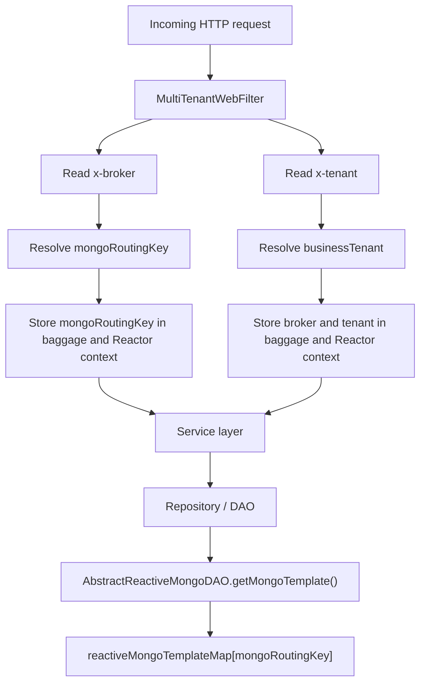

# Minterprise Multitenancy Implementation Plan

## Goal

The goal is to make `minterprise` use the incoming request headers:

- `x-broker`
- `x-tenant`

to determine the correct DB for that request, and then make sure that same routing information is available everywhere in the request flow, including all DB reads and writes.

The desired behavior is:

1. request comes in with `x-broker` and/or `x-tenant`
2. request-level tenant context is resolved once
3. that context is available throughout the request
4. every DB activity uses the resolved routing key
5. detached `.subscribe()` flows do not silently lose this routing context

## One-line conclusion

To achieve multitenancy in `minterprise`, we need to do **two things together**:

1. introduce real request-time tenant/broker/routing-key resolution
2. remove or contain detached `.subscribe()` usage from request-path code

If we do only the first part, context will still be flaky.
If we do only the second part, routing will still stay hardcoded.

Both are required.

## Current codebase state

## 1. Request headers already exist

The codebase already accepts `x-tenant` and `x-broker` in many controllers.

Examples:

- [SachetController.java](/Users/biswajitrout/companyProjects/minterprise/transactional-flows/src/main/java/com/sachetProduct/controllers/SachetController.java)
- [PaymentController.java](/Users/biswajitrout/companyProjects/minterprise/application/src/main/java/com/application/controller/PaymentController.java)
- [LeadController.java](/Users/biswajitrout/companyProjects/minterprise/application/src/main/java/com/application/controller/LeadController.java)

Constants are already defined in [TenantConstant.java](/Users/biswajitrout/companyProjects/minterprise/library/src/main/java/com/library/constant/TenantConstant.java):

- `TENANT_HEADER = "x-tenant"`
- `BROKER_HEADER = "x-broker"`
- `TENANT_DB_BAGGAGE = "tenant"`
- `DEFAULT_TENANT = "axisbank"`
- `DEFAULT_BROKER = "axisbank"`

## 2. Web filter exists, but tenant extraction is hardcoded

Current request entry filter:

- [MultiTenantWebFilter.java](/Users/biswajitrout/companyProjects/minterprise/application/src/main/java/com/application/filter/MultiTenantWebFilter.java)

Current behavior:

```java
private String extractTenant(final ServerWebExchange exchange) throws BrokerNotFoundException {
    return TenantConstant.DEFAULT_TENANT;
}
```

So right now:

- the filter runs for every request
- but it does not actually inspect `x-broker` or `x-tenant`
- it always puts the default tenant in baggage

## 3. Baggage lookup is also hardcoded

Current baggage helper:

- [BaggageUtil.java](/Users/biswajitrout/companyProjects/minterprise/library/src/main/java/com/leads/utils/BaggageUtil.java)

Current behavior:

```java
public String getTenantBaggage(String baggageName) {
    return TenantConstant.DEFAULT_TENANT;
}
```

So even if the filter were fixed later, the lookup helper still returns the default tenant.

## 4. DAO routing is already designed around baggage

Current DB routing points:

- [AbstractReactiveMongoDAO.java](/Users/biswajitrout/companyProjects/minterprise/library/src/main/java/com/library/dao/mongodb/AbstractReactiveMongoDAO.java)
- [MultiTenantMongoFactory.java](/Users/biswajitrout/companyProjects/minterprise/library/src/main/java/com/library/multitenant/mongodb/MultiTenantMongoFactory.java)

Current DAO routing:

```java
String tenant = baggageUtil.getTenantBaggage(TenantConstant.TENANT_DB_BAGGAGE);
return reactiveMongoTemplateMap.get(tenant);
```

This means the architecture is already close to what we want. The problem is:

- the routing value being read is hardcoded

## 5. Mongo template map already supports multiple DBs

Reactive Mongo templates are created in:

- [MultiTenantMongoReactiveDataConfiguration.java](/Users/biswajitrout/companyProjects/minterprise/library/src/main/java/com/library/multitenant/mongodb/MultiTenantMongoReactiveDataConfiguration.java)

The templates are keyed by `tenantId` from configuration:

```java
result.put(tenantId, source);
reactiveMongoTemplateMap.put(entry.getKey(), reactiveMongoTemplate);
```

So the platform already supports multiple templates.

## 6. Current configured datasource keys

From local config, the configured datasource keys are:

- `turtlemint`
- `axisbank`

That means the current practical routing key looks more like a DB key / broker key than a pure business tenant key.

## What is broken today

## 1. Routing is not dynamic

Even though controllers receive `x-broker` and `x-tenant`, DB routing still effectively becomes:

```text
request -> MultiTenantWebFilter -> DEFAULT_TENANT
request -> BaggageUtil -> DEFAULT_TENANT
request -> DAO -> reactiveMongoTemplateMap["axisbank"]
```

## 2. Context can be lost in detached `.subscribe()` calls

This is the second major problem.

Files with important request-path `.subscribe()` usage include:

- `DBOperationsUtil`
- `IssuePolicyUtil`
- `PaymentServiceV2Impl`
- `KycServiceImpl`
- `IQuotationServiceImpl`
- `DefaultAggregatorServiceImpl`

Why this matters:

- request context lives in the reactive chain
- baggage/context propagation is reliable when work stays inside the same chain
- `.subscribe()` inside service code starts a new detached subscription
- that new subscription may not carry the same routing context

So even after fixing `MultiTenantWebFilter`, request-path detached writes can still save into the wrong DB.

## 3. Some startup/config loaders still use default tenant directly

Examples:

- [FeatureFlagConfiguration.java](/Users/biswajitrout/companyProjects/minterprise/library/src/main/java/com/library/configuration/FeatureFlagConfiguration.java)
- [LeadStageInfoConfiguration.java](/Users/biswajitrout/companyProjects/minterprise/library/src/main/java/com/leads/configuration/LeadStageInfoConfiguration.java)

Both initialize from:

```java
reactiveMongoTemplateMap.get(TenantConstant.DEFAULT_TENANT)
```

That is fine only if the data is meant to be global. If not, that becomes another multitenancy gap.

## Better model to use

Do not keep only one field called `tenant` and overload it for everything.

Use 3 values:

1. `broker`
2. `businessTenant`
3. `mongoRoutingKey`

Recommended rule for current `minterprise`:

- `mongoRoutingKey = x-broker`
- if `x-broker` is blank, fallback to `x-tenant`

Why:

- the configured datasource keys are currently `axisbank` and `turtlemint`
- that is closer to broker-based DB routing

So even if business tenant and broker both exist, DB routing should use one explicit key.

## Target architecture



## What the updated code should look like

Below is the implementation direction. This is not meant to be copy-pasted blindly, but it is the correct structure to build.

## 1. Add explicit baggage keys

Update [TenantConstant.java](/Users/biswajitrout/companyProjects/minterprise/library/src/main/java/com/library/constant/TenantConstant.java)

### Current

```java
public static final String TENANT_DB_BAGGAGE = "tenant";
```

### Target

```java
public static final String TENANT_BAGGAGE = "businessTenant";
public static final String BROKER_BAGGAGE = "broker";
public static final String MONGO_ROUTING_KEY_BAGGAGE = "mongoRoutingKey";
```

Keep `TENANT_HEADER` and `BROKER_HEADER` as-is.

## 2. Introduce one resolver object

Add a small request context model, for example:

```java
public record RequestTenantContext(
        String broker,
        String businessTenant,
        String mongoRoutingKey,
        String traceId
) {}
```

And one resolver:

```java
public class RequestTenantResolver {

    public RequestTenantContext resolve(ServerWebExchange exchange, String traceId) {
        String broker = firstNonBlank(
                exchange.getRequest().getHeaders().getFirst(TenantConstant.BROKER_HEADER),
                TenantConstant.DEFAULT_BROKER
        );

        String tenant = firstNonBlank(
                exchange.getRequest().getHeaders().getFirst(TenantConstant.TENANT_HEADER),
                broker
        );

        String mongoRoutingKey = broker;

        return new RequestTenantContext(broker, tenant, mongoRoutingKey, traceId);
    }
}
```

## 3. Update `MultiTenantWebFilter`

File:

- [MultiTenantWebFilter.java](/Users/biswajitrout/companyProjects/minterprise/application/src/main/java/com/application/filter/MultiTenantWebFilter.java)

### Current behavior

```java
String tenantValue = extractTenant(exchange);
tracer.createBaggageInScope(TenantConstant.TENANT_DB_BAGGAGE, tenantValue);
return chain.filter(exchange);
```

### Target behavior

```java
public Mono<Void> filter(ServerWebExchange exchange, WebFilterChain chain) {
    return Mono.deferContextual(contextView -> {
        String traceId = extractTraceId();
        RequestTenantContext tenantContext = requestTenantResolver.resolve(exchange, traceId);

        exchange.getAttributes().put("requestTenantContext", tenantContext);

        tracer.createBaggageInScope(TenantConstant.BROKER_BAGGAGE, tenantContext.broker());
        tracer.createBaggageInScope(TenantConstant.TENANT_BAGGAGE, tenantContext.businessTenant());
        tracer.createBaggageInScope(TenantConstant.MONGO_ROUTING_KEY_BAGGAGE, tenantContext.mongoRoutingKey());
        tracer.createBaggageInScope(X_TRACE_ID, traceId);

        return chain.filter(exchange)
                .contextWrite(ctx -> ctx
                        .put(TenantConstant.BROKER_BAGGAGE, tenantContext.broker())
                        .put(TenantConstant.TENANT_BAGGAGE, tenantContext.businessTenant())
                        .put(TenantConstant.MONGO_ROUTING_KEY_BAGGAGE, tenantContext.mongoRoutingKey())
                );
    });
}
```

### Important behavior

- resolve once
- store once
- all downstream code reads from the same source

## 4. Fix `BaggageUtil`

File:

- [BaggageUtil.java](/Users/biswajitrout/companyProjects/minterprise/library/src/main/java/com/leads/utils/BaggageUtil.java)

### Current

```java
public String getTenantBaggage(String baggageName) {
    return TenantConstant.DEFAULT_TENANT;
}
```

### Target

```java
public String getBaggage(String baggageName) {
    if (tracer == null) {
        return null;
    }
    Baggage baggage = tracer.getBaggage(baggageName);
    return baggage != null ? baggage.get() : null;
}

public String getMongoRoutingKey() {
    return getBaggage(TenantConstant.MONGO_ROUTING_KEY_BAGGAGE);
}

public String getBroker() {
    return getBaggage(TenantConstant.BROKER_BAGGAGE);
}

public String getBusinessTenant() {
    return getBaggage(TenantConstant.TENANT_BAGGAGE);
}
```

### Important rule

Do not fallback silently to `DEFAULT_TENANT` inside the baggage helper.

If the routing key is missing, fail fast. Silent fallback will hide multitenancy bugs.

## 5. Update Mongo routing

Files:

- [AbstractReactiveMongoDAO.java](/Users/biswajitrout/companyProjects/minterprise/library/src/main/java/com/library/dao/mongodb/AbstractReactiveMongoDAO.java)
- [MultiTenantMongoFactory.java](/Users/biswajitrout/companyProjects/minterprise/library/src/main/java/com/library/multitenant/mongodb/MultiTenantMongoFactory.java)

### Current

```java
String tenant = baggageUtil.getTenantBaggage(TenantConstant.TENANT_DB_BAGGAGE);
return reactiveMongoTemplateMap.get(tenant);
```

### Target

```java
String mongoRoutingKey = baggageUtil.getMongoRoutingKey();
Assert.hasText(mongoRoutingKey, "Unable to resolve mongo routing key!");
ReactiveMongoTemplate template = reactiveMongoTemplateMap.get(mongoRoutingKey);
Assert.notNull(template, "No ReactiveMongoTemplate configured for routing key: " + mongoRoutingKey);
return template;
```

### Why this matters

This is the real DB switch point. Once this is correct, every repository call can route to the right DB.

## 6. Remove direct default-tenant startup assumptions

Files:

- [FeatureFlagConfiguration.java](/Users/biswajitrout/companyProjects/minterprise/library/src/main/java/com/library/configuration/FeatureFlagConfiguration.java)
- [LeadStageInfoConfiguration.java](/Users/biswajitrout/companyProjects/minterprise/library/src/main/java/com/leads/configuration/LeadStageInfoConfiguration.java)

### Current

```java
reactiveMongoTemplateMap.get(TenantConstant.DEFAULT_TENANT)
```

### Target options

Option 1:
- keep these intentionally global, and document that they are always read from one config DB

Option 2:
- make them load per routing key or per request where applicable

For now, the safe plan is:

- leave them explicit
- rename/document them as global-default config loaders if that is the intention
- do not pretend they are multitenant if they are not

## 7. Fix request-path `.subscribe()` usage

This is the most important runtime stability step after fixing the filter.

### Current bad pattern

```java
repository.save(entity).subscribe();
leadService.saveLead(lead).subscribe();
anotherRepository.update(...).subscribe();

return Mono.just(success);
```

### Why this fails

These operations are detached from the main request chain.

Even with `Hooks.enableAutomaticContextPropagation()`, this is still risky because:

- the new subscription is separate
- it can run later
- it can run without the same baggage in scope
- failures are detached from the request response

### Target pattern

```java
return repository.save(entity)
        .then(leadService.saveLead(lead))
        .then(anotherRepository.update(...))
        .thenReturn(success);
```

### Priority files

Start with these:

1. [DBOperationsUtil.java](/Users/biswajitrout/companyProjects/minterprise/transactional-flows/src/main/java/com/sachetProduct/util/DBOperationsUtil.java)
2. [IssuePolicyUtil.java](/Users/biswajitrout/companyProjects/minterprise/transactional-flows/src/main/java/com/sachetProduct/util/IssuePolicyUtil.java)
3. [PaymentServiceV2Impl.java](/Users/biswajitrout/companyProjects/minterprise/transactional-flows/src/main/java/com/sachetProduct/service/impl/PaymentServiceV2Impl.java)
4. [KycServiceImpl.java](/Users/biswajitrout/companyProjects/minterprise/transactional-flows/src/main/java/com/sachetProduct/service/impl/KycServiceImpl.java)
5. [IQuotationServiceImpl.java](/Users/biswajitrout/companyProjects/minterprise/transactional-flows/src/main/java/com/sachetProduct/service/impl/IQuotationServiceImpl.java)
6. [DefaultAggregatorServiceImpl.java](/Users/biswajitrout/companyProjects/minterprise/transactional-flows/src/main/java/com/sachetProduct/service/impl/DefaultAggregatorServiceImpl.java)

These are the paths where DB save/update behavior most directly affects business transactions.

## 8. Handle Kafka and scheduler flows separately

`MultiTenantWebFilter` only helps HTTP requests.

It does not automatically help:

- Kafka consumers
- scheduled jobs
- internal async jobs
- callback processors not started from a request chain

For those flows, the routing key must come from:

- message headers
- message payload
- DB lookup based on reference id

Then the code should explicitly set the same baggage/context before doing repository work.

Recommended helper:

```java
public <T> Mono<T> withTenantContext(String broker, String businessTenant, Supplier<Mono<T>> work) {
    String mongoRoutingKey = broker;

    tracer.createBaggageInScope(TenantConstant.BROKER_BAGGAGE, broker);
    tracer.createBaggageInScope(TenantConstant.TENANT_BAGGAGE, businessTenant);
    tracer.createBaggageInScope(TenantConstant.MONGO_ROUTING_KEY_BAGGAGE, mongoRoutingKey);

    return work.get();
}
```

This helper should be used in:

- Kafka consumers
- scheduler callbacks
- standalone processor services

## Step-by-step implementation sequence

## Phase 1: Introduce the routing model

### Changes

1. Add new baggage constants
2. Add `RequestTenantContext`
3. Add `RequestTenantResolver`
4. Decide routing rule:
   - `mongoRoutingKey = x-broker`
   - fallback `x-tenant`

### Output

- design is explicit
- no guessing later in service code

## Phase 2: Fix request entry and baggage

### Changes

1. Update `MultiTenantWebFilter`
2. Update `BaggageUtil`
3. Add request logging for:
   - broker
   - businessTenant
   - mongoRoutingKey
   - traceId

### Output

- every request has a real resolved routing context

## Phase 3: Switch DAO routing to the routing key

### Changes

1. Update `AbstractReactiveMongoDAO`
2. Update `MultiTenantMongoFactory`
3. Fail fast when routing key is missing or not configured

### Output

- repository layer now uses real request-derived routing

## Phase 4: Remove detached subscriptions from critical write paths

### Changes

Start with:

1. `DBOperationsUtil`
2. `IssuePolicyUtil`
3. `PaymentServiceV2Impl`
4. `KycServiceImpl`
5. `DefaultAggregatorServiceImpl`
6. `IQuotationServiceImpl`

### Rule

- no `repository.save(...).subscribe()` inside request-path service methods
- instead return `Mono` or compose into the current `Mono`

### Output

- DB writes stay in the same request chain
- routing key is preserved naturally

## Phase 5: Fix shared config loaders and defaults

### Changes

1. review `FeatureFlagConfiguration`
2. review `LeadStageInfoConfiguration`
3. remove silent default-tenant assumptions where they are wrong

### Output

- config loading behavior becomes explicit

## Phase 6: Extend multitenancy to background flows

### Changes

1. add tenant-context helper
2. update Kafka consumers
3. update schedulers
4. update callback-only services

### Output

- non-HTTP flows also route correctly

## Phase 7: Add tests and guardrails

### Required tests

1. HTTP request with `x-broker=axisbank` saves to axisbank DB
2. HTTP request with `x-broker=turtlemint` saves to turtlemint DB
3. two concurrent requests with different brokers do not cross-save
4. one request path with formerly detached save still uses correct routing
5. background consumer flow uses payload-derived routing key

### Recommended guardrails

1. log routing key on each request at debug level
2. log routing key inside DAO at trace/debug level
3. fail fast if routing key is blank
4. fail fast if no template exists for routing key

## Rollout recommendation

Do this in order:

1. routing constants + context model
2. `MultiTenantWebFilter`
3. `BaggageUtil`
4. DAO routing
5. request-path subscribe cleanup
6. async/background context support
7. tests

Do **not** start with all subscribe cleanup across the repo at once.

The first milestone should be:

- a request with `x-broker=turtlemint` routes to `reactiveMongoTemplateMap["turtlemint"]`

Once that works, then clean request-path subscriptions in the business services.

## Practical answer to the `.subscribe()` challenge

You asked:

> because of `.subscribe()` it runs as a separate thread execution and loses context, in that case how will it extract the broker

The practical answer is:

- it should **not need to extract broker again**
- the broker and routing key should already be attached to the running request context
- but detached `.subscribe()` breaks that assumption

So the strategy is:

1. for normal request flows, do not detach work with `.subscribe()`
2. for forced async flows, pass broker/tenant explicitly and re-create context before DB activity

That is the clean solution.

## Final recommendation

For the current `minterprise` codebase, the best implementation strategy is:

- route DB by a new explicit `mongoRoutingKey`
- resolve it from `x-broker` first
- keep `tenant` as business metadata
- remove detached `.subscribe()` from request-path DB work
- explicitly re-create tenant context in Kafka/scheduler flows

This gives you predictable DB routing and avoids silent default-tenant writes.
