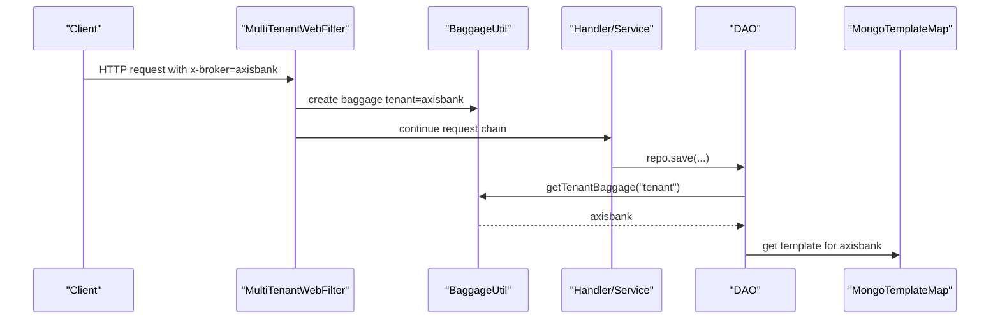
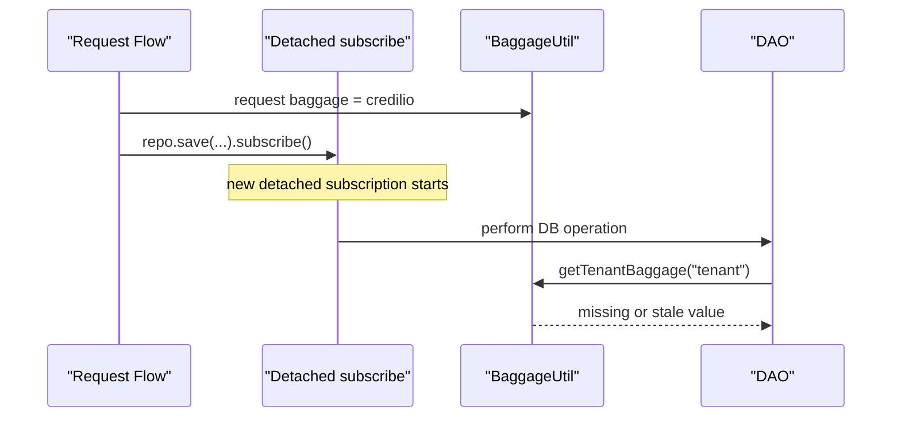
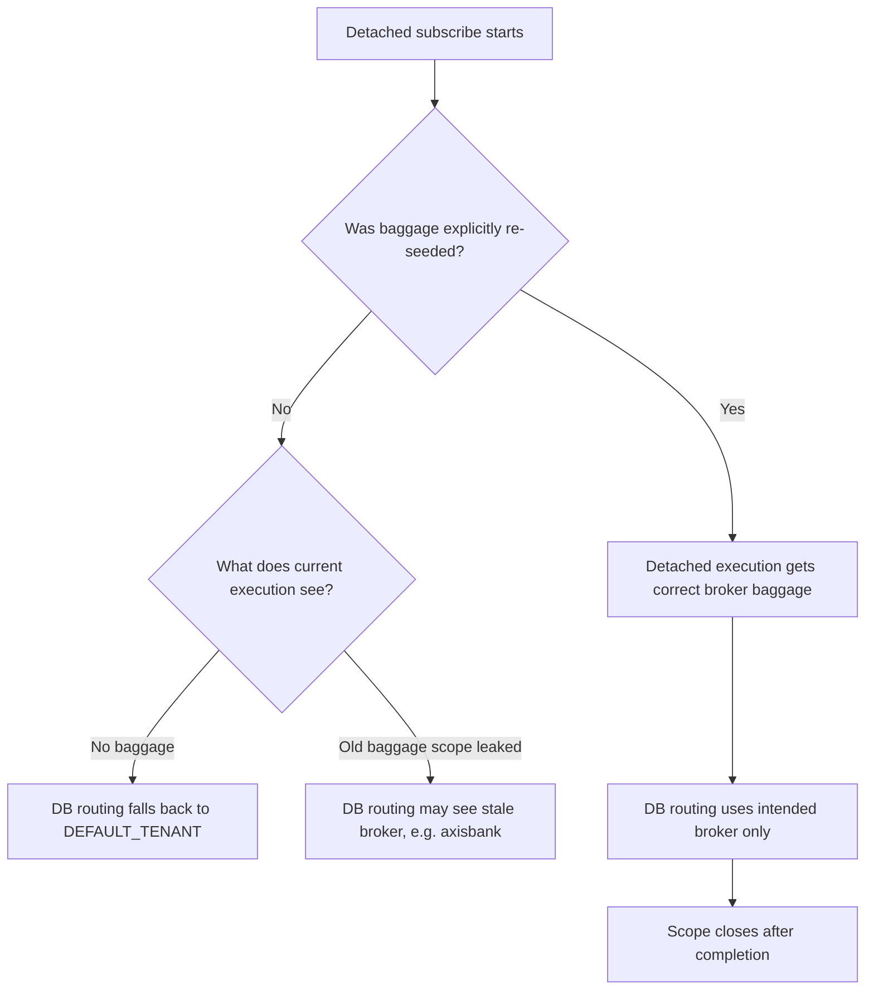
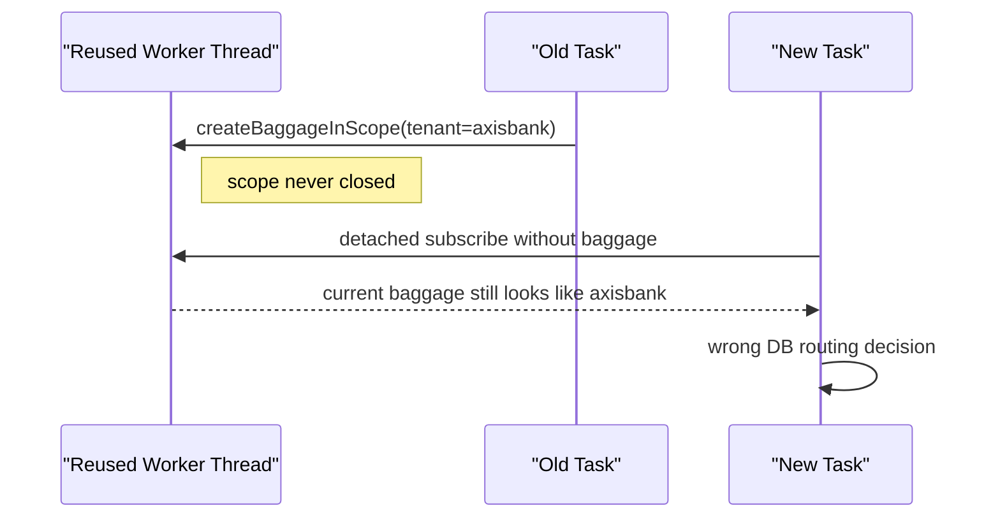
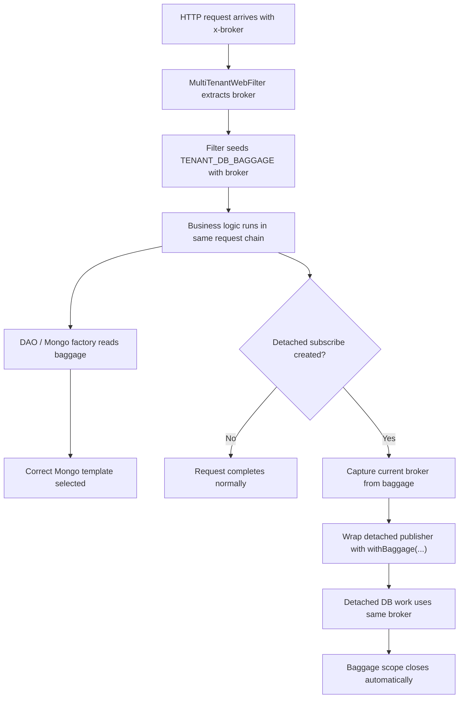

# Multitenancy, Baggage, and Detached `subscribe()` Report

## Purpose

This report captures the complete discussion around dynamic broker-based multitenancy in `minterprise`, especially:

- why using `TenantConstant.DEFAULT_TENANT` as runtime carrier will not work in shared infra
- why detached `.subscribe()` can break tenant/broker routing
- which approaches will not work and why
- what the correct design is for HTTP request flows
- how Kafka, schedulers, and other non-HTTP entry points should be handled
- the code snippets needed to implement the design

This report is intentionally detailed and includes diagrams because the main source of confusion here is the difference between:

- global state
- request-scoped baggage
- thread reuse
- detached subscriptions

## Short Answer

The routing key should be taken from `x-broker` at the HTTP entry point, stored in baggage, and read from baggage by the DB layer.

Detached `.subscribe()` calls must explicitly recreate the same baggage for that detached execution. Otherwise the detached execution may:

- lose the original request-scoped broker and fall back to default
- or, if a previous baggage scope was left open, observe stale baggage on a reused thread

So the correct model for this codebase is:

- HTTP request path: `x-broker -> baggage -> DB`
- detached async subscribe path: `capture current broker -> open baggage for detached execution -> close baggage after completion`
- Kafka / scheduler / background entry point: explicitly seed baggage because there is no HTTP request baggage there

## Current State in the Codebase

### Constants

`TenantConstant` today has:

```java
public static final String TENANT_HEADER = "x-tenant";
public static final String BROKER_HEADER = "x-broker";
public static final String TENANT_DB_BAGGAGE = "tenant";
public static final String DEFAULT_TENANT = "axisbank";
public static final String DEFAULT_BROKER = "axisbank";
```

Source:

- `library/src/main/java/com/library/constant/TenantConstant.java`

### Current Routing Flow

The DB routing path is already baggage-driven:

- `application/src/main/java/com/application/filter/MultiTenantWebFilter.java`
- `library/src/main/java/com/leads/utils/BaggageUtil.java`
- `library/src/main/java/com/library/dao/mongodb/AbstractReactiveMongoDAO.java`
- `library/src/main/java/com/library/multitenant/mongodb/MultiTenantMongoFactory.java`

Today, however, the routing is effectively hardcoded because:

```java
public String getTenantBaggage(String baggageName) {
    return TenantConstant.DEFAULT_TENANT;
}
```

So even though the DB layer asks baggage for the routing key, it is still getting `axisbank` every time.

### Automatic Context Propagation

The app already enables:

```java
Hooks.enableAutomaticContextPropagation();
```

Source:

- `application/src/main/java/com/application/MinterpriseApplication.java`

This helps within the same reactive chain, including scheduler hops.  
It does **not** make detached manual `.subscribe()` automatically safe.

## Design Goal

We want dynamic broker-based routing where:

1. HTTP request comes in with `x-broker`
2. `MultiTenantWebFilter` extracts that broker
3. That broker is stored in baggage under `TENANT_DB_BAGGAGE`
4. `BaggageUtil` reads the current baggage
5. DB routing reads that baggage value and picks the correct `ReactiveMongoTemplate`

Even though the baggage key is named `TENANT_DB_BAGGAGE`, it can still carry broker if broker is the DB routing key.

## What Will Not Work

This section intentionally comes first.

### 1. Mutating `TenantConstant.DEFAULT_TENANT` at Runtime

This will not work for shared infra.

Example bad idea:

```java
TenantConstant.DEFAULT_TENANT = brokerFromHeader;
```

Why it fails:

- `DEFAULT_TENANT` is supposed to be fallback state, not request-scoped state
- one JVM handles many concurrent requests
- request A may be `axisbank`
- request B may be `credilio`
- a shared mutable value would become "latest tenant seen", not "tenant for this request"

Failure example:

1. Request A arrives with `x-broker=axisbank`
2. Global runtime tenant becomes `axisbank`
3. Request B arrives with `x-broker=credilio`
4. Global runtime tenant becomes `credilio`
5. Request A later hits the DB
6. DB routing sees `credilio`
7. Request A data gets written to the wrong DB

This is exactly why runtime routing must be request-scoped, not process-scoped.

### 2. Using Reactor `contextWrite(...)` Alone

This will not fix DB routing in the current codebase.

Example:

```java
repo.save(entity)
    .contextWrite(ctx -> ctx.put(TenantConstant.TENANT_DB_BAGGAGE, tenant))
    .subscribe();
```

Why it fails:

- Reactor `Context` and Micrometer tracing baggage are not the same thing
- current DB routing reads baggage via `BaggageUtil`
- current DB routing does **not** read `ContextView`

So unless DAO code is redesigned to read Reactor `Context`, this approach does not change which DB gets selected.

### 3. Using `subscribeOn(...)` as the Multitenancy Fix

This will not solve the problem.

Example:

```java
repo.save(entity)
    .subscribeOn(Schedulers.boundedElastic())
    .subscribe();
```

Why it fails:

- `subscribeOn(...)` changes scheduler
- it does not seed baggage
- DB routing still depends on baggage being available

So `subscribeOn(...)` is never the multitenancy fix. It is only a scheduling choice.

### 4. Raw `doFirst(() -> createBaggageInScope(...))` Without Closing Scope

This is directionally correct but still unsafe in raw form.

Example:

```java
repo.save(entity)
    .doFirst(() -> baggageUtil.createBaggageInScope(TenantConstant.TENANT_DB_BAGGAGE, tenant))
    .subscribe();
```

Why it is incomplete:

- it opens baggage scope
- it never closes that scope
- stale baggage can remain active on a reused thread

This can produce routing bugs later in unrelated work.

### 5. `try (BaggageInScope ...) { return mono; }` Around Lazy Reactive Code

This is a very subtle failure mode and already appears in the repo.

Current pattern example:

- `library/src/main/java/com/library/utils/payoutsUtils/PayoutsNotificationUtil.java`

Pattern:

```java
try (BaggageInScope baggage = tracer.createBaggageInScope(...)) {
    log.debug("Baggage set");
}

return productCatalogService.getProductCatalogByProductCode(...).flatMap(...);
```

Why it fails:

- `Mono` and `Flux` are lazy
- the `try` block closes immediately
- the reactive work starts later when someone subscribes
- by that time the baggage scope is already gone

So the code "looks" scoped, but the actual execution happens after the scope closed.

### 6. Assuming There Is an "Axisbank Thread" or a "Credilio Thread"

This is not how it works.

Threads are reused across many requests and tasks:

- Netty event-loop threads
- Reactor scheduler threads
- boundedElastic threads
- worker pool threads

So the mental model should not be:

- "this is an axisbank thread"

It should be:

- "this reused thread is currently executing work under some baggage scope"

### 7. Assuming Kafka or Scheduler Flows Can Read Request Baggage

This will not work because there is no HTTP request there.

Examples:

- `reports/src/main/java/com/reports/utils/ReportSchedulerUtil.java`
- `library/src/main/java/com/library/services/kafka/BaseKafkaConsumer.java`

Why it fails:

- schedulers do not start from an HTTP request
- Kafka consumers do not automatically inherit baggage from the producer's HTTP request
- if the message or job does not explicitly carry broker, there is nothing to reconstruct dynamically

So non-HTTP entry points must seed baggage explicitly.

### 8. Expecting Dynamic Routing When the Message / Job Does Not Carry Broker

If a Kafka message or cron job does not contain broker, the app cannot infer it reliably.

So one of these must be true:

- the broker is carried in the message headers / payload
- the job is explicitly for a configured broker
- the job iterates over all supported brokers
- fallback to default is intentionally accepted

Without one of the above, dynamic routing is not deterministically possible.

## Why Detached `.subscribe()` Causes Problems

This is the core issue.

### Important Clarification

The problem is **not** simply "another thread".

The bigger problem is:

- the HTTP request is one subscription / execution scope
- a manual `.subscribe()` creates a **new detached subscription**

So the original request baggage belongs to the original request execution.  
The new detached execution is not automatically guaranteed to carry it.

### Example

```java
return service.call()
    .doOnSuccess(data -> repo.save(data).subscribe());
```

There are now two executions:

1. original request subscription
2. detached `repo.save(...).subscribe()` subscription

The DB save now runs under `2`, not `1`.

So the detached execution may not have the original broker baggage.

### What "Context Gets Lost" Really Means

Better phrasing:

> The detached subscribe is no longer reliably bound to the request scope that created it.

That means the detached execution can see:

- no baggage at all
- or stale baggage if some previous scope was left open

### Sequence Diagram: Normal HTTP Path



### Sequence Diagram: Detached Subscribe Without Re-Seeding



### Flow Diagram: Missing vs Stale Baggage



## How Stale Baggage Leakage Happens

### `createBaggageInScope(...)` Is Like Push / Pop

When you call:

```java
BaggageInScope scope = tracer.createBaggageInScope("tenant", "axisbank");
```

conceptually this behaves like:

```java
oldValue = currentBaggage
currentBaggage = "axisbank"

// later
scope.close()
currentBaggage = oldValue
```

If `close()` is not called, the previous state is never restored.

### Why Thread Reuse Matters

Threads are pooled and reused.

So if:

1. task A opens baggage `axisbank`
2. task A never closes it
3. task B later runs on the same reused thread
4. task B did not seed its own baggage

then task B may still observe `axisbank`.

That is what "stale baggage leakage on reused threads" means.

### Diagram: Stale Scope Leak



### Important Correction

We are not "closing threads properly".  
We need to close the **baggage scope**, not the thread.

## What Will Work

This is the correct design for the current codebase.

### Core Rule

Use this rule everywhere:

- same reactive chain as the HTTP request -> baggage is already available
- detached `.subscribe()` -> explicitly recreate baggage before that detached execution starts
- Kafka / scheduler / background entry point -> explicitly seed baggage because there is no request baggage there

### Why This Works

Because the current DB routing classes already read baggage:

- `AbstractReactiveMongoDAO`
- `MultiTenantMongoFactory`

So once we stop hardcoding `DEFAULT_TENANT` in `BaggageUtil`, and once detached subscriptions are re-seeded, the DB path automatically becomes correct.

## Recommended Implementation

### 1. Keep `DEFAULT_TENANT` as Fallback Only

`DEFAULT_TENANT` should remain:

- immutable
- process-wide fallback
- never used as runtime request carrier

It is okay for:

- header defaults for backward compatibility
- fallback when baggage is genuinely missing
- explicit scheduler / job defaults when that is intentional

It is not okay for:

- per-request runtime switching

### 2. Read `x-broker` in `MultiTenantWebFilter`

`MultiTenantWebFilter` should seed baggage from the HTTP request.

Suggested code:

```java
package com.application.filter;

import com.application.exceptions.BrokerNotFoundException;
import com.leads.utils.BaggageUtil;
import com.library.constant.TenantConstant;
import io.micrometer.tracing.Tracer;
import lombok.Setter;
import lombok.extern.slf4j.Slf4j;
import org.springframework.core.Ordered;
import org.springframework.stereotype.Component;
import org.springframework.util.StringUtils;
import org.springframework.web.server.ServerWebExchange;
import org.springframework.web.server.WebFilter;
import org.springframework.web.server.WebFilterChain;
import reactor.core.publisher.Mono;

import java.util.Objects;

import static com.library.constant.FieldNameConstant.X_TRACE_ID;

@Component
@Slf4j
public class MultiTenantWebFilter implements WebFilter, Ordered {

    private final Tracer tracer;
    private final BaggageUtil baggageUtil;

    @Setter
    private int order;

    public MultiTenantWebFilter(Tracer tracer, BaggageUtil baggageUtil) {
        this.tracer = tracer;
        this.baggageUtil = baggageUtil;
    }

    @Override
    public int getOrder() {
        return order;
    }

    @Override
    public Mono<Void> filter(ServerWebExchange exchange, WebFilterChain chain) {
        String broker = extractBroker(exchange);
        String traceId = extractTraceId();

        if (StringUtils.hasText(traceId)) {
            exchange.getResponse().getHeaders().add("X-Server-Trace-Id", traceId);
        }

        return baggageUtil.withBaggage(
                TenantConstant.TENANT_DB_BAGGAGE,
                broker,
                baggageUtil.withBaggage(
                        X_TRACE_ID,
                        traceId,
                        chain.filter(exchange)
                )
        );
    }

    private String extractBroker(ServerWebExchange exchange) {
        String broker = exchange.getRequest().getHeaders().getFirst(TenantConstant.BROKER_HEADER);
        if (!StringUtils.hasText(broker)) {
            throw new BrokerNotFoundException("Missing x-broker header");
        }
        return broker;
    }

    private String extractTraceId() {
        try {
            return Objects.requireNonNull(
                    tracer.currentTraceContext().context(),
                    "No current trace context available"
            ).traceId();
        } catch (NullPointerException e) {
            log.error("Failed to extract trace ID: No active trace context found.", e);
            return null;
        }
    }
}
```

### 3. Make `BaggageUtil` the Source of Truth for Routing Value

`BaggageUtil` should read actual baggage and provide a safe wrapper for detached reactive executions.

Suggested code:

```java
package com.leads.utils;

import com.library.constant.TenantConstant;
import io.micrometer.tracing.Baggage;
import io.micrometer.tracing.BaggageInScope;
import io.micrometer.tracing.Span;
import io.micrometer.tracing.Tracer;
import lombok.extern.slf4j.Slf4j;
import org.springframework.stereotype.Component;
import org.springframework.util.StringUtils;
import reactor.core.publisher.Flux;
import reactor.core.publisher.Mono;

@Component
@Slf4j
public class BaggageUtil {

    private final Tracer tracer;

    public BaggageUtil(Tracer tracer) {
        this.tracer = tracer;
    }

    public BaggageInScope createBaggageInScope(String baggageName, String value) {
        return tracer.createBaggageInScope(baggageName, value);
    }

    public String getTenantBaggage(String baggageName) {
        return getBaggage(baggageName);
    }

    public String getBaggage(String baggageName) {
        if (tracer == null) {
            return TenantConstant.DEFAULT_TENANT;
        }

        Baggage baggage = tracer.getBaggage(baggageName);
        String value = baggage != null ? baggage.get() : null;

        return StringUtils.hasText(value) ? value : TenantConstant.DEFAULT_TENANT;
    }

    public <T> Mono<T> withBaggage(String baggageName, String value, Mono<T> mono) {
        if (!StringUtils.hasText(value)) {
            return mono;
        }

        return Mono.using(
                () -> tracer.createBaggageInScope(baggageName, value),
                ignored -> Mono.defer(() -> mono),
                BaggageInScope::close
        );
    }

    public <T> Flux<T> withBaggage(String baggageName, String value, Flux<T> flux) {
        if (!StringUtils.hasText(value)) {
            return flux;
        }

        return Flux.using(
                () -> tracer.createBaggageInScope(baggageName, value),
                ignored -> Flux.defer(() -> flux),
                BaggageInScope::close
        );
    }

    public Span createSpan(String spanName) {
        return tracer.nextSpan().name(spanName).start();
    }

    public Tracer.SpanInScope setSpan(Span span) {
        return tracer.withSpan(span);
    }
}
```

### 4. Let the DB Layer Keep Reading Baggage

The DB layer already uses baggage. Only stronger validation is useful.

Suggested code for `AbstractReactiveMongoDAO`:

```java
protected ReactiveMongoTemplate getMongoTemplate() {
    String tenant = baggageUtil.getTenantBaggage(TenantConstant.TENANT_DB_BAGGAGE);
    Assert.hasText(tenant, "Unable to get tenant to determine mongoTemplate!");

    ReactiveMongoTemplate template = reactiveMongoTemplateMap.get(tenant);
    Assert.notNull(template, "No mongoTemplate configured for tenant: " + tenant);

    return template;
}
```

Same logic applies to `MultiTenantMongoFactory`.

### 5. Wrap Detached `.subscribe()` Executions

This is the fix for separate execution boundaries.

Pattern:

```java
String broker = baggageUtil.getBaggage(TenantConstant.TENANT_DB_BAGGAGE);

baggageUtil.withBaggage(
        TenantConstant.TENANT_DB_BAGGAGE,
        broker,
        repo.save(entity)
).subscribe();
```

This works because:

1. current request broker is captured before detaching
2. detached execution gets a fresh baggage scope with the same broker
3. DB routing reads that broker from baggage
4. scope closes automatically on completion / error / cancel

### 6. `subscribeOn(...)` Can Still Be Used, But It Is Not the Fix

If a scheduler switch is needed, use it inside `withBaggage(...)`:

```java
String broker = baggageUtil.getBaggage(TenantConstant.TENANT_DB_BAGGAGE);

baggageUtil.withBaggage(
        TenantConstant.TENANT_DB_BAGGAGE,
        broker,
        repo.save(entity).subscribeOn(Schedulers.boundedElastic())
).subscribe();
```

Multitenancy here is still solved by baggage, not by `subscribeOn`.

## Example Replacements in Existing Code

This is not an exhaustive migration list, but these are good starting points.

### `IssuePolicyUtil`

Current pattern:

```java
issuanceResultRepository.save(issuanceResult)
        .log()
        .subscribeOn(Schedulers.boundedElastic())
        .subscribe();
```

Recommended:

```java
String broker = baggageUtil.getBaggage(TenantConstant.TENANT_DB_BAGGAGE);

baggageUtil.withBaggage(
        TenantConstant.TENANT_DB_BAGGAGE,
        broker,
        issuanceResultRepository.save(issuanceResult)
                .log()
                .subscribeOn(Schedulers.boundedElastic())
).subscribe();
```

### `PremiumServiceUtil`

Current pattern:

```java
defaultAggregatorService.saveAggregatorPremiumResult(quotationResponse).subscribe();
```

Recommended:

```java
String broker = baggageUtil.getBaggage(TenantConstant.TENANT_DB_BAGGAGE);

baggageUtil.withBaggage(
        TenantConstant.TENANT_DB_BAGGAGE,
        broker,
        defaultAggregatorService.saveAggregatorPremiumResult(quotationResponse)
).subscribe();
```

### Important Audit Targets

Detached `.subscribe()` hotspots that should be reviewed for baggage safety include:

- `transactional-flows/src/main/java/com/sachetProduct/util/IssuePolicyUtil.java`
- `transactional-flows/src/main/java/com/sachetProduct/util/PremiumServiceUtil.java`
- `transactional-flows/src/main/java/com/sachetProduct/util/DBOperationsUtil.java`
- `transactional-flows/src/main/java/com/sachetProduct/service/impl/PaymentServiceV2Impl.java`
- `library/src/main/java/com/leads/service/impl/LdLeadServiceImpl.java`
- `transactional-flows/src/main/java/com/sachetProduct/service/aggregator/SachetActive360Aggregator.java`
- `transactional-flows/src/main/java/com/sachetProduct/service/aggregator/SachetSspAggregator.java`
- `transactional-flows/src/main/java/com/sachetProduct/service/aggregator/SachetRsaAggregator.java`

These are only examples, not the full list.

## HTTP vs Non-HTTP: What Should Read Baggage

This distinction is critical.

### Request-Scoped Path

These should become baggage-driven:

- `MultiTenantWebFilter`
- `BaggageUtil.getTenantBaggage(...)`
- `AbstractReactiveMongoDAO`
- `MultiTenantMongoFactory`

Flow:

1. read `x-broker`
2. store in baggage
3. DB reads baggage

### Controller Header Defaults

Many controllers still use:

```java
@RequestHeader(name = "x-tenant", defaultValue = TenantConstant.DEFAULT_TENANT)
```

This is not the same as DB routing.

These defaults can remain for:

- backward compatibility
- business logic that still expects tenant argument

But they should not be treated as the runtime source of DB routing once baggage-based routing is enabled.

### Non-HTTP Entry Points

These cannot "extract from request baggage" because there is no HTTP request:

- Kafka consumers
- schedulers
- cron jobs
- offline report generation
- internal background tasks

For these, you must explicitly seed baggage.

## Kafka Handling

### What Will Not Work

This will not work:

```java
baggageUtil.getTenantBaggage(TenantConstant.TENANT_DB_BAGGAGE);
```

at the start of a Kafka consumer if no baggage has been seeded yet.

Why:

- Kafka consumer execution is not automatically tied to some HTTP request baggage

### What Must Happen

The Kafka message should carry broker somewhere:

- Kafka headers
- message payload
- topic-to-broker mapping

Then the consumer must seed baggage before processing.

Suggested pattern for `BaseKafkaConsumer`:

```java
@Override
public Mono<?> consumeMessages(ReceiverRecord<Object, Object> record) {
    String broker = extractBrokerFromRecord(record)
            .orElse(TenantConstant.DEFAULT_TENANT);

    String payload = record.value().toString();

    return baggageUtil.withBaggage(
            TenantConstant.TENANT_DB_BAGGAGE,
            broker,
            process(payload, record)
                    .doOnSuccess(unused -> record.receiverOffset().acknowledge())
                    .doOnError(e -> log.error(
                            "[{}] Error processing message from topic: {}",
                            getClass().getSimpleName(),
                            getTopic(),
                            e
                    ))
                    .onErrorResume(e -> Mono.empty())
    );
}
```

If the event does not contain broker, then you must choose one of these strategies:

- enrich the event schema
- use topic-level routing metadata
- use explicit default and accept non-dynamic behavior

## Scheduler / Cron / Report Handling

### What Will Not Work

A scheduler cannot rely on request baggage because there is no request.

Also this pattern is unsafe for reactive lazy execution:

```java
try (BaggageInScope ignored = tracer.createBaggageInScope(...)) {
    return someMono();
}
```

because the scope closes before the returned `Mono` actually executes.

### What Must Happen

The scheduler must decide which broker it is running for.

That can be:

- one explicit default broker
- a configured broker per job
- all supported brokers in a loop

Then the job must run inside baggage scope.

Example for one explicit broker:

```java
public Mono<?> generateDailyReport() {
    String broker = TenantConstant.DEFAULT_TENANT;

    return baggageUtil.withBaggage(
            TenantConstant.TENANT_DB_BAGGAGE,
            broker,
            reportService.generateAllReportsByCron(startDate, endDate, "", frequency, authToken)
    );
}
```

Example if the job must run for all brokers:

```java
Flux.fromIterable(List.of("axisbank", "credilio", "bankfab"))
        .flatMap(broker -> baggageUtil.withBaggage(
                TenantConstant.TENANT_DB_BAGGAGE,
                broker,
                reportService.generateAllReportsByCron(startDate, endDate, "", frequency, authToken)
        ))
        .subscribe();
```

## How Baggage Propagation and Thread Reuse Actually Relate

This is the corrected mental model.

### Wrong Mental Model

- "There is an axisbank thread"
- "There is a credilio thread"

### Correct Mental Model

- threads are reused
- baggage is scope-bound
- the current execution decides which baggage is visible
- if detached execution does not carry baggage, DB routing becomes unreliable
- if baggage scopes are leaked, reused threads may expose stale baggage

### One-Line Summary

It is not that the thread belongs to `axisbank` or `credilio`.  
It is that a reused thread may be executing under the wrong or stale baggage scope if we do not manage baggage properly.

## End-to-End Recommended Flow



## Migration Plan

### Phase 1

Fix the request-scoped routing path:

- update `MultiTenantWebFilter` to read `x-broker`
- update `BaggageUtil.getTenantBaggage(...)` to read real baggage
- keep DB routing in `AbstractReactiveMongoDAO` and `MultiTenantMongoFactory`

### Phase 2

Introduce `BaggageUtil.withBaggage(...)` and start wrapping detached `.subscribe()` paths.

### Phase 3

Audit non-HTTP entry points:

- Kafka
- schedulers
- reports
- background utilities

and explicitly seed baggage there.

### Phase 4

Optionally clean up naming:

- `TENANT_DB_BAGGAGE` is currently semantically carrying broker
- if the team wants, it can later be renamed to something like `DB_ROUTING_BAGGAGE`

This rename is optional and not required for the fix.

## Final Conclusions

### What We Rejected

These are not acceptable as the multitenancy solution:

- mutating `DEFAULT_TENANT` at runtime
- relying only on `contextWrite(...)`
- using `subscribeOn(...)` as if it propagates tenant
- opening baggage scope without closing it
- wrapping lazy `Mono` creation in `try-with-resources` and returning after the scope has already closed
- assuming Kafka / scheduler flows can inherit HTTP request baggage automatically

### What We Accepted

The correct solution for this codebase is:

1. `MultiTenantWebFilter` reads `x-broker`
2. filter seeds baggage using `TENANT_DB_BAGGAGE`
3. `BaggageUtil` reads actual baggage instead of hardcoded `DEFAULT_TENANT`
4. DB routing continues to read from `BaggageUtil`
5. detached `.subscribe()` executions are wrapped with `withBaggage(...)`
6. Kafka / schedulers / reports explicitly seed baggage because they are not HTTP request flows

### Final Rule

If the work is still inside the same reactive request chain, baggage will be available.  
If a new detached execution is created, baggage must be recreated explicitly for that execution.

