# Life Quotes API – End-to-End Flow

**Endpoint:** `POST /api/minterprise/v2/products/life/quotes`  
**Entry Point:** `SachetController.addQuotation()`  
**Supports:** Normal quote flow + Requote flow (same endpoint)

---

## High-Level Architecture

```
Client → SachetController → IQuotationServiceImpl → SachetLifeAggregator
                                                           ↓
                                              LifeRequestValidationService
                                              (Product Catalogue + Nearest Match)
                                                           ↓
                                              buildLifeServiceRequests()
                                              (per-insurer QuotationRequest objects)
                                                           ↓
                                              PremiumServiceUtil.getIHPremiumResponse()
                                                           ↓
                                              LifePremiumDispatchService
                                              (build IH request → call IH → normalize response)
                                                           ↓
                                              Save to DB → Async Rider Prices
                                                           ↓
                                              fetchRequestAndAggregateResultsFromDB()
                                              (flatten, compact, enrich, return)
```

---

## Step-by-Step Flow

### 1. Controller Entry — `SachetController.addQuotation()`

**File:** `SachetController.java` (line ~126)

- Deserializes `request.data` into `QuotationRequest`
- Sets headers: `tenant`, `broker`, `partnerId`, `transactionSource`, `transactionMode`
- Delegates to `quotationService.generateQuote(request)`

### 2. Service Entry — `IQuotationServiceImpl.generateQuote()`

**File:** `IQuotationServiceImpl.java` (line ~116)

**Life-specific branch** (skips generic `validationAggregator`):

1. **Extract `riskInsured`** from `premiumRequest.riskInsured` → `request.setRiskInsured()`
2. **Call `validatePremium(request)`** — handles persistence:
   - `normalizeLifeRequestForStorage()` — derives and stores plan defaults
   - Checks `referenceId`:
     - **Blank** (new quote) → generates new `referenceId` via `UniqueIdGenerator`
     - **Present** (requote) → stashes `insurerSpecificInfo` for requote, loads existing DB record to preserve `_id` and `createdAt`
   - Generates new `quoteId` (UUID)
   - **Saves to MongoDB**: `sachetPremiumRequest` collection (strips `quoteId` from persisted copy for life)
   - **Saves history**: `sachetPremiumRequestHistory` collection
3. **Resolve aggregator**: `gridPremiumAggregatorFactory.getPremiumAggregator("life")` → returns `SachetLifeAggregator`
4. **Delegates to** `SachetLifeAggregator.generateQuote(request)`

### 3. Life Aggregator Orchestration — `SachetLifeAggregator.generateQuote()`

**File:** `SachetLifeAggregator.java` (line ~187)

1. **Build configured providers** list (from `request.provider` if specified)
2. **Validate providers**: `lifeRequestValidationService.resolveValidatedProviders(request, configuredProviders)`
3. **Filter for requote**: `filterValidationResultForRequote(request, validationResult)` — narrows results to only the products being requoted
4. **Build service requests**: `buildLifeServiceRequests(request, effectiveValidationResult)` — creates per-insurer-per-plan `QuotationRequest` objects
5. **If no requests and requote** → returns existing aggregated response from DB
6. **Dispatch**: `fetchCustomPremiumResponse(serviceRequests, request)` → `PremiumServiceUtil.getIHPremiumResponse()`
7. **After IH completes** → `fetchRequestAndAggregateResultsFromDB()` to build final response
8. **Filter requote response**: only includes the requoted product codes

### 4. Validation & Product Resolution — `LifeRequestValidationService.resolveValidatedProviders()`

**File:** `LifeRequestValidationService.java` (line ~49)

#### 4a. Input Normalization
- Extracts `planDetails` from `premiumRequest` → flat request map
- Merges `riskInsured.insuredMembers[0]` fields: `dateOfBirth`, `entryAge`, `gender`
- Merges `proposerDetails` fields: `propDOB`, `propAge`, `propGender`
- **Derives defaults** (`applyLifeDefaultDerivations()`):
  - `entryAge` from `dateOfBirth` if missing
  - `maturityAge` based on category (term: 60/65/75, retirement: 100, whole-life: 95)
  - `policyTerm` = `maturityAge - entryAge`
  - `premiumPaymentTerm` defaults to `policyTerm` (or 1 for single-pay)
  - `investmentTermCode` based on policy term

#### 4b. Product Catalogue Fetch (External API #1)

**Call:** `LifeProductCatalogueService.fetchProductDetails(broker)`  
**Endpoint:** `POST {integration-hub-base-url}/api/product-management/v1/products/details/filters`  
**Purpose:** Fetches all enabled life products for the broker

#### 4c. Product Filtering Pipeline
```
Product Catalogue Response
    → matchesPlanType()         — filter by TERM/ULIP/etc.
    → matchesPolicyType()       — filter by policyType (only if planType absent)
    → matchesCategories()       — filter by category tags
    → matchesPaymentFrequency() — filter by payment frequency mode
    → matchesCurrency()         — filter by currency (default INR)
    → matchesSelectedPlans()    — filter by user-selected plan IDs
    → matchesInsurer()          — filter by configured insurer codes
    → applyPayoutDefaults()     — default payout type (LUMPSUM for ULIP, INCOME otherwise)
    → filterByPayoutSettings()  — filter by payoutType, payoutTerm, payoutFrequency
    → filterByPlanFeatures()    — filter by features like jointLife, returnOfPremium
```

#### 4d. Validator Row Creation & Nearest Match (External API #2)

**Call:** Creates validator rows per product → calls nearest-match API  
**Endpoint:** `POST {nearest-match-base-url}/api/product-management/v1/life-validator`  
**Purpose:** Resolves nearest valid PT/PPT/SA combinations for each product

#### 4e. Output
Returns `LifeValidationResult`:
- `providers` — list of eligible insurer providers
- `validationMap` — per-product validation data
- `rowsByProvider` — map of `insurerCode → List<validatorRows>` (each row = one plan variant)

### 5. Per-Insurer Request Construction — `buildLifeServiceRequests()`

**File:** `SachetLifeAggregator.java` (line ~404)

For each `insurerCode` and each validator row:
1. Clones the original `QuotationRequest`
2. Sets `provider`, `insurerCode`, `planCode`, `category`
3. Injects `insurerCode` and `tenant` into `riskInsured`
4. Attaches metadata to `otherDetails`:
   - `lifeRequestValidatorRows` — the matched validator row
   - `lifeScopedValidatorRows` — all rows for this insurer
   - `lifeValidationMap` — full validation map

#### 5a. Pre-Enrichment — `attachLifePreEnrichmentMeta()` (External API #3)

**File:** `SachetLifeAggregator.java` (line ~471)

**Call:** `lifeQuoteMasterDataEnrichmentService.fetchRiderOfferMetaForPreEnrichment(insurerCode, validationContext)`  
**DB Lookups:** Fetches rider and offer master data from MongoDB  
**Outputs attached to `otherDetails`:**
- `riderMasterList` — full rider catalog for the product
- `offerMasterList` — full offer catalog
- `riderInfoList` — rider list with selection state
- `offerInfoList` — offer list with selection state

For **requote** (single-result selections exist):
- `applySingleResultSelectionOverrides()` — overrides rider/offer selections from the previous quote's user choices

### 6. IH Dispatch — `PremiumServiceUtil.getIHPremiumResponse()`

**File:** `PremiumServiceUtil.java` (line ~906)

For each service request (concurrently with configurable max concurrency):

1. **Life-specific path** → `lifePremiumDispatchService.fetchPreparedLifeQuotationResult(serviceRequest)`
2. **Wraps result** → `defaultAggregatorService.createPremiumResult()` (sets common fields: referenceId, quoteId, provider, etc.)
3. **Normalizes IDs** → `normalizeLifePremiumResponseIdsForPersistence()` (generates UUID-based `quoteId` per variant/option)
4. **Saves to DB** → `sachetPremiumResponse` collection
5. **Triggers async rider prices** → `lifeRiderPricesAsyncService.generateAndSaveRiderPrices()` (fire-and-forget)

### 7. IH Request Build & Dispatch — `LifePremiumDispatchService.fetchPreparedLifeQuotationResult()`

**File:** `LifePremiumDispatchService.java` (line ~51)

#### 7a. Build Integration Request — `LifeQuoteIntegrationRequestBuilder.build()`

**File:** `LifeQuoteIntegrationRequestBuilder.java` (line ~94)

Constructs `IntegrationRequest` with:

| Component | Source | Details |
|-----------|--------|---------|
| **`scope.request`** | `LifeIntegrationRequestMapper` | age, gender, DOB, sumAssured/premium, policyTerm, PPT, paymentFrequency, smoker, state, pincode, category, riders, offers, payoutType, insurerSpecificInfo |
| **`scope.master`** | Master Service V2 API | Occupation/qualification mappings (term only) |
| **`scope.constants`** | MongoDB `lifeInsurerProviderMeta` | Insurer-specific constants (broker-scoped) |
| **`scope.insurerConfig`** | MongoDB `brokerConfig` | Broker-level insurer config |
| **`scope.partnerDetails`** | Mintpro Partner API (HDFC only) | DP number, branch code, license |
| **`mappingQuery`** | Derived | insurerCode, `PREMIUM_REQUEST`, `LIFE`, broker, internalProductCode |

**Insurer-specific enrichments:**
- **BAJAJ:** `enrichBajajCoverDetailsRider()` — adds cover code rider
- **TATAAIALI/DIGITLI:** `enrichPlanCodeFromRuleEngine()` → calls Rule Engine API
- **ICICI PRU:** Date format `yyyy-MM-dd` (others use `dd/MM/yyyy`)
- **insurerSpecificInfo:** Variant-matched from requote payload → sets `Requote=Yes/No`

**Rider/Offer in request:**
- Filters `riderInfoList` for selected/inbuilt riders → sets `request.rider`
- Filters `offerInfoList` for selected offers → sets `request.offer`
- Sets `followUpRequest=true` if any riders/offers selected

**External APIs during build:**
- Master Service V2: `GET /api/v2/masters/master-mappings/{broker}/{insurer}/OCCUPATION/LIFE/filter`
- Master Service V2: `GET /api/v2/masters/master-mappings/{broker}/{insurer}/QUALIFICATION/LIFE/filter`
- Mintpro Partner: `GET {mintpro-partner-api-url}/{clientId}` (HDFC only)
- Rule Engine: `POST {rule-engine-base-url}/api/rules/v0/life/planCodes` (TATAAIALI/DIGITLI only)

#### 7b. Send to Integration Hub (External API #4)

**Call:** `ihService.sendLifeIntegrationRequestToIH(integrationRequest)`  
**Purpose:** IH resolves the insurer adapter, transforms the request, and calls the insurer API

#### 7c. Response Normalization

On **success** (`buildQuoteResultFromIHResponse()`):
1. **Normalizer dispatch**: `LifeResponseNormalizerFactory.getNormalizer(insurerCode)` — picks insurer-specific or generic normalizer
2. **Normalize IH data**: `normalizer.normalize(ihData, request)` — extracts `premiumResponse` from insurer-specific wrapper keys (e.g., `bajajliResponse`, `iciciPruLiResponse`, `hdfcliResponse`, etc.)
3. **Field normalization**:
   - `premiumWithoutTax`/`basePremium` → `premium`
   - `serviceTax`/`appTax`/`totalTax` → `taxRate`
   - `totalPremium`/`totPremium` → `premiumWithTax`
4. **Enrich with validator row**: copies `optionCode`, `productCode`, `internalProductCode`, `insurerCode`, `planType`, metadata fields
5. **Carry pre-enrichment meta**: preserves `_preValidatedRiderInfoList`, `_preValidatedOfferInfoList`, scoped validator rows, broker

On **error** (`buildQuoteResultFromIHError()`):
- Creates `LifeQuotationResult` with `status=failed`, `premium=0`, error message from exception
- Still enriches with validator row and carries pre-enrichment meta

#### 7d. Pre-Persistence Enrichment

**Call:** `lifeQuoteMasterDataEnrichmentService.enrichQuoteResponse(premiumResponse, true)`  
**Purpose:** Enriches with company details, rider validation data, plan feature details before DB save

### 8. Async Rider Prices — `LifeRiderPricesAsyncService.generateAndSaveRiderPrices()`

**File:** `LifeRiderPricesAsyncService.java`  
**Trigger:** Fire-and-forget after each successful quote result is saved  

Uses external APIs:
- **Rider Slab:** `POST {rule-engine-base-url}/api/rules/v0/life/riders/slab`
- **Rider Validate:** `POST {rule-engine-base-url}/api/rules/v0/life/riders/validate`

### 9. Response Aggregation — `fetchRequestAndAggregateResultsFromDB()`

**File:** `IQuotationServiceImpl.java` (line ~215)

1. **Load stored request** from `sachetPremiumRequest` by `referenceId`
2. **Load all quote results** from `sachetPremiumResponse` by `referenceId` + `quoteId`
3. **Build aggregated response** (`buildAggregatedQuoteResponse()`):
   - **Flatten**: `flattenLifeQuoteRowsForResponse()` → compacts duplicate rows by `referenceId|provider|planCode`
   - **Merge variants**: `mergeLifeQuoteRowsForResponse()` → deduplicates variants by `productCode|optionCode`, picks best by score
   - **Enrich**: `mergeLifeResponseFieldsFromStoredProductDetails()` — pulls `premiumResponse` from `productDetails` if present
   - **Build API quotes**: `buildLifeApiQuotes()` → normalizes each quote, calls `lifeQuoteMasterDataEnrichmentService.enrichQuoteResponse()`, ensures core fields (`_id`, `productCode`, `insurerCode`, `quoteId`, `status`)
   - **Pending keys**: computes `pendingKeyList` and aggregate status (`success`/`pending`/`partial`/`failed`)
4. **Filter for requote**: `filterLifeRequoteResponse()` — if requote, only returns the requested `productCode` quotes and pending keys

---

## Requote Flow (Same Endpoint)

A request with an existing `referenceId` and `insurerSpecificInfo` in `premiumRequest` triggers the requote path:

```
Requote Detection:
  - referenceId is present (not blank)
  - premiumRequest.insurerSpecificInfo contains keys like "{insurerCode}_{productCode}_{optionCode}"

Requote-specific behavior:
  1. stashLifeRequoteInsurerSpecificInfo() — moves insurerSpecificInfo to internal key
  2. Existing DB record loaded → preserves _id, createdAt
  3. filterValidationResultForRequote() — filters validation to only requested product keys
  4. buildLifeServiceRequests() only creates requests for matched insurer+product combos
  5. resolveInsurerSpecificInfo() in request builder sets Requote=Yes for matched variants
  6. filterLifeRequoteResponse() — final response only contains requoted products
```

---

## MongoDB Collections

| Collection | Purpose | Key Fields |
|------------|---------|------------|
| `sachetPremiumRequest` | Stores the latest quote request | `referenceId`, `productCode`, `premiumRequest`, `riskInsured` |
| `sachetPremiumRequestHistory` | Audit trail of all requests | Same as above + timestamps |
| `sachetPremiumResponse` | Individual insurer quote results | `referenceId`, `quoteId`, `provider`, `planCode`, `premiumResponse`, `status` |
| `lifeInsurerProviderMeta` | Insurer constants | `Insurer_Code`, `Stage=PREMIUM`, `Constants` |
| `brokerConfig` | Broker-level insurer config | `broker`, `insurerConfig` |

---

## External API Summary

| # | API | Endpoint | Purpose | Called From |
|---|-----|----------|---------|-------------|
| 1 | Product Catalogue | `POST /api/product-management/v1/products/details/filters` | Fetch enabled life products | `LifeRequestValidationService` |
| 2 | Life Validator (Nearest Match) | `POST /api/product-management/v1/life-validator` | Resolve nearest valid PT/PPT/SA | `LifeRequestValidationService` |
| 3 | Integration Hub | IH internal dispatch | Execute insurer quote | `LifePremiumDispatchService` |
| 4 | Master Service V2 | `GET /api/v2/masters/master-mappings/{broker}/{insurer}/{type}/LIFE/filter` | Occupation/Qualification mapping (term only) | `LifeQuoteIntegrationRequestBuilder` |
| 5 | Mintpro Partner API | `GET {url}/{clientId}` | Partner details (HDFC only) | `LifeQuoteIntegrationRequestBuilder` |
| 6 | Rule Engine - Plan Codes | `POST /api/rules/v0/life/planCodes` | Resolve plan code (TATA/DIGIT only) | `LifeQuoteIntegrationRequestBuilder` |
| 7 | Rule Engine - Rider Slab | `POST /api/rules/v0/life/riders/slab` | Rider price slabs | `LifeRiderPricesAsyncService` |
| 8 | Rule Engine - Rider Validate | `POST /api/rules/v0/life/riders/validate` | Rider validation | `LifeRiderPricesAsyncService` |

---

## Flowchart

```mermaid
flowchart TB
    A["POST /api/minterprise/v2/products/life/quotes"] --> B["SachetController.addQuotation()"]
    B --> C["IQuotationServiceImpl.generateQuote()"]
    
    C --> D["Extract riskInsured from premiumRequest"]
    D --> E["validatePremium()"]
    
    E --> F{"referenceId present?"}
    F -- No --> G["Generate new referenceId"]
    F -- Yes --> H["Load existing request from DB\nStash insurerSpecificInfo for requote"]
    G --> I["Generate quoteId, Save to MongoDB"]
    H --> I
    
    I --> J["SachetLifeAggregator.generateQuote()"]
    
    J --> K["LifeRequestValidationService\n.resolveValidatedProviders()"]
    
    K --> K1["Normalize request fields\nDerive entryAge, policyTerm, PPT, maturityAge"]
    K1 --> K2["📡 Fetch Product Catalogue\nPOST /api/product-management/v1/products/details/filters"]
    K2 --> K3["Filter: planType → policyType → category\n→ frequency → currency → plans → insurer\n→ payout → features"]
    K3 --> K4["📡 Nearest Match\nPOST /api/product-management/v1/life-validator"]
    K4 --> K5["Group rows by provider\nBuild validationMap"]
    
    K5 --> L{"Is Requote?"}
    L -- Yes --> L1["filterValidationResultForRequote()\nKeep only requested insurer_product keys"]
    L -- No --> M["buildLifeServiceRequests()"]
    L1 --> M
    
    M --> M1["Per insurer+plan: clone request\nSet provider, planCode, category"]
    M1 --> M2["📡 Fetch Rider/Offer Meta\nfrom MongoDB via enrichment service"]
    M2 --> M3["Attach riderMasterList, offerMasterList,\nriderInfoList, offerInfoList to otherDetails"]
    
    M3 --> N["PremiumServiceUtil\n.getIHPremiumResponse()"]
    
    N --> O["For each serviceRequest (concurrent)"]
    
    O --> P["LifePremiumDispatchService\n.fetchPreparedLifeQuotationResult()"]
    
    P --> P1["LifeQuoteIntegrationRequestBuilder.build()"]
    P1 --> P1a["Build LifeIntegrationRequestMapper\nage, DOB, gender, SA/premium, PT, PPT,\nsmoker, riders, offers, insurerSpecificInfo"]
    P1a --> P1b["Fetch master mappings, constants,\ninsurer config from DB"]
    P1b --> P1c{"Insurer-specific?"}
    P1c -- BAJAJ --> P1d["Add cover details rider"]
    P1c -- TATA/DIGIT --> P1e["📡 Rule Engine: planCodes"]
    P1c -- HDFC --> P1f["📡 Mintpro Partner API"]
    P1c -- Other --> P1g["Standard build"]
    P1d --> P2
    P1e --> P2
    P1f --> P2
    P1g --> P2
    
    P2["📡 IH: sendLifeIntegrationRequestToIH()"]
    
    P2 --> P3{"IH Success?"}
    P3 -- Yes --> P4["LifeResponseNormalizerFactory\n→ insurer-specific normalizer"]
    P3 -- No --> P5["Build error LifeQuotationResult\nstatus=failed, premium=0"]
    
    P4 --> P6["Normalize response fields\npremium, tax, premiumWithTax"]
    P6 --> P7["Enrich with validator row metadata\nCarry pre-enrichment meta"]
    P5 --> P7
    
    P7 --> P8["enrichQuoteResponse()\nCompany details, rider data"]
    
    P8 --> Q["createPremiumResult()\nSet referenceId, quoteId, provider"]
    Q --> Q1["Normalize quoteId to UUID per variant"]
    Q1 --> Q2["Save to sachetPremiumResponse"]
    Q2 --> Q3["🔥 Async: Rider Prices\n📡 riders/slab + riders/validate"]
    
    Q3 --> R["fetchRequestAndAggregateResultsFromDB()"]
    R --> R1["Load all results from DB"]
    R1 --> R2["Flatten & compact quote rows\nGroup by referenceId|provider|planCode"]
    R2 --> R3["Merge variant duplicates\nPick best by score"]
    R3 --> R4["enrichQuoteResponse() per quote\nEnsure _id, productCode, insurerCode, quoteId"]
    R4 --> R5["Compute pendingKeyList\nResolve aggregate status"]
    R5 --> R6{"Is Requote?"}
    R6 -- Yes --> R7["Filter response to only\nrequoted productCodes"]
    R6 -- No --> R8["Return full QuotationResponse"]
    R7 --> R8
```



---

## Key Classes Reference

| Class | Responsibility |
|-------|---------------|
| `SachetController` | REST controller, request deserialization |
| `IQuotationServiceImpl` | Request validation, persistence, response aggregation |
| `SachetLifeAggregator` | Life-specific orchestration, requote logic |
| `LifeRequestValidationService` | Product catalogue fetch, filtering, nearest match |
| `LifeQuoteIntegrationRequestBuilder` | IH request payload construction |
| `LifePremiumDispatchService` | IH dispatch, response normalization |
| `LifeResponseNormalizerFactory` | Insurer-specific response normalizer dispatch |
| `PremiumServiceUtil` | Concurrent IH execution, result save, async rider trigger |
| `LifeQuoteMasterDataEnrichmentService` | Rider/offer metadata, company details, response enrichment |
| `LifeRiderPricesAsyncService` | Async rider price generation via rule engine |
| `DefaultAggregatorService` | Generic result creation, persistence |
