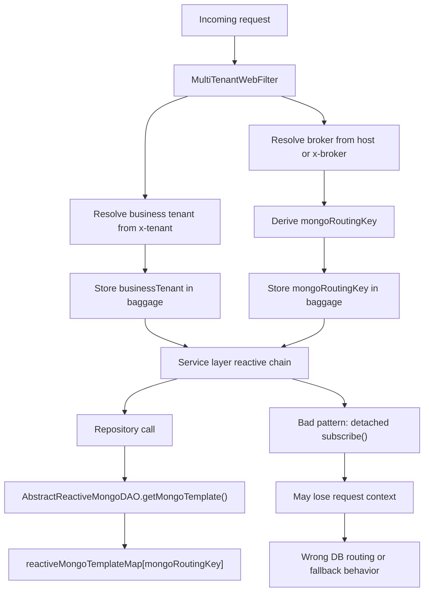

# Multitenancy Review For `ON/remove-subscribe-phase1` -> `phase4`

## Purpose

This document reviews the multitenancy-related impact of the following branches in the order they were created:

1. `origin/ON/remove-subscribe-phase1`
2. `origin/ON/remove-subscribe-phase2`
3. `origin/ON/remove-subscribe-phase3`
4. `origin/ON/remove-subscribe-phase4`

The main question is not just "did these branches remove `subscribe()` calls", but:

- do they make `minterprise` truly multitenant
- how do they differ from `develop`
- which phase is safest from a multitenancy point of view
- what should ideally be used in `minterprise` right now

## Executive summary

These branches do **not** implement true multitenancy by themselves.

They mainly improve **reactive context propagation** by removing detached `.subscribe()` calls from important request flows. That matters because `minterprise` chooses the Mongo template using baggage/context, so detached subscriptions can execute outside the original request chain and can lose the correct routing context.

That said, the core tenant-resolution path is still hardcoded on `develop` and remains effectively hardcoded across these phase branches:

- [MultiTenantWebFilter.java](/Users/biswajitrout/companyProjects/minterprise/application/src/main/java/com/application/filter/MultiTenantWebFilter.java) always returns `TenantConstant.DEFAULT_TENANT`
- [BaggageUtil.java](/Users/biswajitrout/companyProjects/minterprise/library/src/main/java/com/leads/utils/BaggageUtil.java) returns `TenantConstant.DEFAULT_TENANT` for `getTenantBaggage(...)`
- [MultiTenantMongoFactory.java](/Users/biswajitrout/companyProjects/minterprise/library/src/main/java/com/library/multitenant/mongodb/MultiTenantMongoFactory.java) and [AbstractReactiveMongoDAO.java](/Users/biswajitrout/companyProjects/minterprise/library/src/main/java/com/library/dao/mongodb/AbstractReactiveMongoDAO.java) both route DB access using that baggage value

So the short answer is:

- these branches improve multitenancy **support**
- they do **not** make multitenancy complete
- `phase3` is the cleanest branch for this specific purpose
- `phase4` is not the best branch for multitenancy because it reintroduces some detached `subscribe()` patterns

## How multitenancy works on `develop` today

### Request entry

Current request routing starts in [MultiTenantWebFilter.java](/Users/biswajitrout/companyProjects/minterprise/application/src/main/java/com/application/filter/MultiTenantWebFilter.java).

What it does:

1. `filter(...)` calls `extractTenant(exchange)`
2. `extractTenant(...)` returns `TenantConstant.DEFAULT_TENANT`
3. that value is stored in tracing baggage using `TENANT_DB_BAGGAGE`

Important issue:

- `extractTenant(...)` does not currently resolve from `x-tenant`, `x-broker`, host, or any request metadata
- it always returns the default tenant

### Baggage lookup

DB routing later depends on [BaggageUtil.java](/Users/biswajitrout/companyProjects/minterprise/library/src/main/java/com/leads/utils/BaggageUtil.java).

What it does:

- `getTenantBaggage(...)` returns `TenantConstant.DEFAULT_TENANT`
- it does not read the real tracer baggage value

Important issue:

- even if request baggage were set correctly, the main lookup helper still returns the default value

### Mongo routing

Mongo routing is done in:

- [MultiTenantMongoFactory.java](/Users/biswajitrout/companyProjects/minterprise/library/src/main/java/com/library/multitenant/mongodb/MultiTenantMongoFactory.java)
- [AbstractReactiveMongoDAO.java](/Users/biswajitrout/companyProjects/minterprise/library/src/main/java/com/library/dao/mongodb/AbstractReactiveMongoDAO.java)

What they do:

- read `TENANT_DB_BAGGAGE`
- use that value as key into `reactiveMongoTemplateMap`

So the intended flow is:

```text
request -> web filter -> baggage -> reactive mongo template map -> tenant DB
```

But the actual current flow is closer to:

```text
request -> default tenant "axisbank" -> baggage helper returns "axisbank" -> reactive mongo template map["axisbank"]
```

### Supporting configuration still default-tenant based

These are also still fixed to the default tenant:

- [FeatureFlagConfiguration.java](/Users/biswajitrout/companyProjects/minterprise/library/src/main/java/com/library/configuration/FeatureFlagConfiguration.java)
- [LeadStageInfoConfiguration.java](/Users/biswajitrout/companyProjects/minterprise/library/src/main/java/com/leads/configuration/LeadStageInfoConfiguration.java)

Both initialize data from:

- `reactiveMongoTemplateMap.get(TenantConstant.DEFAULT_TENANT)`

### Datasource keys in local config

The configured datasource keys in local config are:

- `turtlemint`
- `axisbank`

Source:

- [application-local.yml](/Users/biswajitrout/companyProjects/minterprise/application/src/main/resources/application-local.yml)

This matters because the routing key currently looks more like a **broker/database key** than a business tenant identifier.

## Why removing `subscribe()` matters for multitenancy

This is the main idea behind the phase branches.

In reactive code, calling `.subscribe()` inside service logic often creates a **detached side-effect**:

- the outer request chain continues
- the inner DB or lead-save operation runs separately
- that inner operation may not execute with the same request context

In `minterprise`, DB routing depends on context/baggage. So detached subscriptions are risky because:

1. they can run after the main request chain has moved on
2. they can run on another scheduler/subscriber
3. they can lose the intended routing context
4. they can silently fall back to default routing behavior

So even though these branches do not fix tenant extraction, they do something important:

- they keep more DB work inside the same reactive chain
- that makes future real multitenancy safer
- it also reduces today’s accidental default-tenant behavior once the hardcoding is removed

## High-level verdict by phase

| Branch | Repo `.subscribe(` count | `transactional-flows` `.subscribe(` count | Multitenancy routing changed | Multitenancy support impact |
| --- | ---: | ---: | --- | --- |
| `develop` | 343 | 117 | No | Baseline, many detached flows |
| `phase1` | 310 | 114 | No | Mostly cleanup, very little request-path gain |
| `phase2` | 292 | 99 | No | Good util-layer improvement |
| `phase3` | 212 | 19 | No | Strongest reactive-context improvement |
| `phase4` | 222 | 60 | No | Regresses from phase3 for this concern |

## Branch-by-branch analysis

## Phase 1

Branch:

- `origin/ON/remove-subscribe-phase1`

### What changed

For multitenancy, phase 1 does **not** change the request filter, baggage lookup, or Mongo routing design.

The only core-adjacent diffs are in:

- [AbstractReactiveMongoDAO.java](/Users/biswajitrout/companyProjects/minterprise/library/src/main/java/com/library/dao/mongodb/AbstractReactiveMongoDAO.java)
- [MultiTenantMongoReactiveDataConfiguration.java](/Users/biswajitrout/companyProjects/minterprise/library/src/main/java/com/library/multitenant/mongodb/MultiTenantMongoReactiveDataConfiguration.java)
- [LeadStageInfoConfiguration.java](/Users/biswajitrout/companyProjects/minterprise/library/src/main/java/com/leads/configuration/LeadStageInfoConfiguration.java)

### What it means

This phase is mostly:

- code cleanup
- DAO helper reduction
- minor Mongo config cleanup

It is **not** where multitenancy becomes safer in any meaningful request-path sense.

### Assessment

- good cleanup branch
- not enough if the goal is multitenancy

## Phase 2

Branch:

- `origin/ON/remove-subscribe-phase2`

### What changed

This is where the first real multitenancy-support improvement starts showing up.

Main changed files:

- `DBOperationsUtil`
- `PremiumServiceUtil`
- `IssuePolicyUtil`
- `ProposalUtil`
- `KycUtil`
- `DefaultAggregatorServiceImpl`
- `SachetProductLeadServiceImpl`

### Important examples

#### 1. `DBOperationsUtil`

In `develop`, methods like these fire DB and lead operations using detached `subscribe()` calls:

- `processOVDSubmitCallbackResponse(...)`
- `processOVDSubmitCallbackResponseV2(...)`
- `performPolicyStatusDBOperations(...)`
- `proposalRejectedDBOperations(...)`
- `policyPendingDBOperations(...)`

In `phase2`, these methods are converted from:

```text
update DB .subscribe()
save lead .subscribe()
share to tenant .subscribe()
```

to:

```text
update DB
  .then(save lead)
  .flatMap(share to tenant)
```

That is a meaningful change because DB update, lead save, and tenant callback now stay in the same reactive chain.

#### 2. `PremiumServiceUtil`

In `develop`, aggregate quote save was done like this:

- build final aggregated quote
- `defaultAggregatorService.saveAggregatorPremiumResult(...).subscribe()`
- immediately return response

In `phase2`, it becomes:

- `saveAggregatorPremiumResult(...).thenReturn(quotationResponse)`

This ensures the save happens as part of the request flow instead of a detached background operation.

#### 3. `IssuePolicyUtil`

`phase2` removes many detached calls from policy issuance paths:

- `issuanceResultRepository.save(...).subscribe()`
- `saveSachetLead(...).subscribe()`

and replaces them with chained `flatMap(...)` and `thenReturn(...)`.

This is exactly the kind of code that benefits multitenancy support because:

- issuance save
- lead save
- communication preparation

stay within the same subscription chain.

### Assessment

This phase improves multitenancy support in a real way, but mainly in the utility layer.

It still does **not** fix:

- tenant extraction
- baggage lookup
- default-tenant config loading

## Phase 3

Branch:

- `origin/ON/remove-subscribe-phase3`

### What changed

This is the strongest branch in the series for multitenancy support.

Main changed files:

- `DefaultAggregatorServiceImpl`
- `IQuotationServiceImpl`
- `PaymentServiceV2Impl`
- `OrderServiceImpl`
- `IssuanceServiceV2Impl`
- `KycServiceImpl`
- `IntegrationServiceImpl`
- `ProposalServiceV2Impl`
- `SachetRsaAggregator`
- `NinjaKafkaConsumer`
- `SachetBikeAggregator`

### Important examples

#### 1. `DefaultAggregatorServiceImpl`

`savePremiumResult(...)` and `saveProposal(...)` are changed so that lead-save and DB-save participate in the same reactive flow instead of being zipped around detached fallback behavior.

This matters because quote/proposal save is one of the most common DB-heavy request paths.

#### 2. `IQuotationServiceImpl`

Two good examples:

- caching in `fetchResultFromDB(...)` is changed from `redisUtil.pushDataToCache(...).subscribe()` to `pushDataToCache(...).thenReturn(val)`
- premium request history save is changed from `savePremiumRequestHistory(...).subscribe()` to `savePremiumRequestHistory(...).thenReturn(r)`

This keeps quote fetch and quote request persistence inside the main chain.

#### 3. `PaymentServiceV2Impl`

This file is improved significantly in phase 3:

- `saveRequest(...)` becomes reactive and returns `Mono`
- payment request history save is chained
- lead save before cart creation is chained
- payment result save and history save are chained
- `transactionPolicyIssue(...)` is moved into a proper chained flow

This is a strong improvement because payment is a multi-step request flow touching several repositories.

Important note:

- even in phase 3, this file still has a few remaining `.subscribe()` calls
- so it is improved, but not fully clean

#### 4. `KycServiceImpl`

Phase 3 improves KYC handling by chaining:

- proposal update
- lead save
- callback processing
- request history save
- KYC request save

Examples:

- `saveKycLead(...)` returns `Mono<PayloadWrapper>` instead of doing `subscribe()`
- `handleKycCallback(...)` returns a reactive result instead of just subscribing internally
- `sendKycIntiateRequest(...)` chains lead-save and KYC result update

This is a good multitenancy-support change because KYC callbacks are exactly the kind of place where detached updates often lose context.

#### 5. `SachetRsaAggregator`

Phase 3 converts:

- `saveIssuanceRequest(...)`
- `savePaymentRequest(...)`
- `savePaymentResult(...)`

from detached `subscribe()` style into chained `Mono` returns.

#### 6. `NinjaKafkaConsumer`

Even the Kafka consumer path is improved:

- `issuanceResultRepository.updateProperties(...).subscribe()`

becomes:

- `return issuanceResultRepository.updateProperties(...)`

That is cleaner and easier to compose.

### Why phase 3 is the best branch in this series

Because it removes detached subscriptions from the main service layer where routing-sensitive work actually happens:

- quote
- proposal
- payment
- issuance
- KYC
- async consumer updates

This is the phase where the branch series most closely aligns with proper reactive multitenant behavior.

### Assessment

- best branch in this series for multitenancy support
- still not true multitenancy
- best baseline if this work is to be continued

## Phase 4

Branch:

- `origin/ON/remove-subscribe-phase4`

### What changed

Phase 4 is not a pure continuation of the multitenancy cleanup.

It contains:

- many unrelated feature/product changes
- some additional library changes
- and, importantly, some regressions compared to phase 3

### Regressions that matter

#### 1. `KycServiceImpl`

Phase 3 had improved this file by returning reactive flows.

Phase 4 brings back detached style in places like:

- `updateProposal(...).subscribe()`
- `defaultAggregatorService.handleKycCallback(...).subscribe()`
- `proposal.log().subscribe()`
- `saveSachetLead(...).subscribe()`

So KYC becomes less safe again from a context-propagation point of view.

#### 2. `DBOperationsUtil`

Phase 2 had turned several DB/lead/share methods into chained `Mono` returns.

Phase 4 reverts a number of them back to `void` methods with internal `subscribe()` calls, for example:

- `processOVDSubmitCallbackResponse(...)`
- `performPolicyStatusDBOperations(...)`
- `proposalRejectedDBOperations(...)`
- `policyPendingDBOperations(...)`
- `sendEventToTenant(...)`

This is a direct regression for multitenancy support.

### Why phase 4 is worse than phase 3 for this topic

The count tells the same story:

- `transactional-flows` `.subscribe(` count in phase 3: `19`
- `transactional-flows` `.subscribe(` count in phase 4: `60`

So phase 4 is broader, but not cleaner for tenant-context safety.

### Assessment

- useful branch for other feature work
- not the best branch for multitenancy support
- regresses some of the good cleanup done in phase 2 and phase 3

## How these branches differ from `develop`

Compared with `develop`, the branch series improves multitenancy support in this order:

### `develop`

- hardcoded tenant routing
- many detached subscriptions in request flows

### `phase1`

- cleanup only
- no meaningful improvement in transactional request chaining

### `phase2`

- util-layer DB/lead/issuance flows become more chained

### `phase3`

- main service layer becomes substantially more reactive and chain-safe
- best branch for preserving context during business flows

### `phase4`

- adds broader work
- reintroduces detached subscriptions in some sensitive flows

## Does this series handle multitenancy perfectly

No.

It does **not** handle multitenancy perfectly for three separate reasons.

### 1. Tenant extraction is still hardcoded

Current tenant resolution still effectively returns the default tenant:

- [MultiTenantWebFilter.java](/Users/biswajitrout/companyProjects/minterprise/application/src/main/java/com/application/filter/MultiTenantWebFilter.java)
- [BaggageUtil.java](/Users/biswajitrout/companyProjects/minterprise/library/src/main/java/com/leads/utils/BaggageUtil.java)

### 2. Some shared configuration still loads from default tenant only

Examples:

- [FeatureFlagConfiguration.java](/Users/biswajitrout/companyProjects/minterprise/library/src/main/java/com/library/configuration/FeatureFlagConfiguration.java)
- [LeadStageInfoConfiguration.java](/Users/biswajitrout/companyProjects/minterprise/library/src/main/java/com/leads/configuration/LeadStageInfoConfiguration.java)

### 3. Detached subscriptions still remain

Even in the best phase, some `.subscribe()` calls remain.

So the series helps, but it does not complete the design.

## What should ideally be used in `minterprise` right now

Given the current codebase, the safest design is:

### 1. Keep three separate concepts

- `broker`
- `businessTenant`
- `mongoRoutingKey`

They should not be treated as the same field.

### 2. Route DB using `mongoRoutingKey`

Right now the configured datasource keys are:

- `axisbank`
- `turtlemint`

So the practical routing key is closer to a broker/database key than a true tenant identifier.

Because of that, the most stable current approach is:

- resolve broker from host or `x-broker`
- derive `mongoRoutingKey` from broker
- carry `businessTenant` separately if needed

### 3. Put resolved values into baggage in `MultiTenantWebFilter`

Instead of:

- `extractTenant(...) -> DEFAULT_TENANT`

it should do something like:

1. read `x-broker`
2. read `x-tenant`
3. derive `mongoRoutingKey`
4. put all three in baggage

### 4. Change DB routing to use `mongoRoutingKey`

Instead of:

- `getTenantBaggage(TENANT_DB_BAGGAGE)`

use:

- a real baggage lookup
- and read `MONGO_ROUTING_KEY_BAGGAGE`

### 5. Keep the phase 2 and phase 3 subscribe-removal work

Even after proper routing is implemented, detached subscriptions will still be dangerous.

So the right long-term combination is:

- real routing key extraction
- real baggage lookup
- reactive chaining without detached `subscribe()` in request paths

## Recommendation

If the question is "which branch handles multitenancy best among these four", the answer is:

- `origin/ON/remove-subscribe-phase3`

If the question is "can I say multitenancy is fully solved by these branches", the answer is:

- no

If the question is "what should `develop` ideally move toward", the answer is:

1. implement real request-time routing in `MultiTenantWebFilter`
2. stop returning default tenant in `BaggageUtil`
3. route Mongo by an explicit `mongoRoutingKey`
4. keep or re-apply the phase 2 and phase 3 subscribe-removal changes
5. do not use phase 4 as the final reference for this specific concern without cleaning the regressions

## Recommended target flow



## Final conclusion

These phase branches are best understood as a **reactive context cleanup series**, not as a complete multitenancy implementation.

They help multitenancy because baggage-based DB routing only works reliably when DB work stays inside the same reactive request chain.

But until the hardcoded tenant path is removed from:

- [MultiTenantWebFilter.java](/Users/biswajitrout/companyProjects/minterprise/application/src/main/java/com/application/filter/MultiTenantWebFilter.java)
- [BaggageUtil.java](/Users/biswajitrout/companyProjects/minterprise/library/src/main/java/com/leads/utils/BaggageUtil.java)

`minterprise` will not be truly multitenant.

For this specific series:

- `phase3` is the best multitenancy-support branch
- `phase4` is broader, but not cleaner for multitenancy
- `develop` still needs real routing-key extraction and baggage lookup fixes
